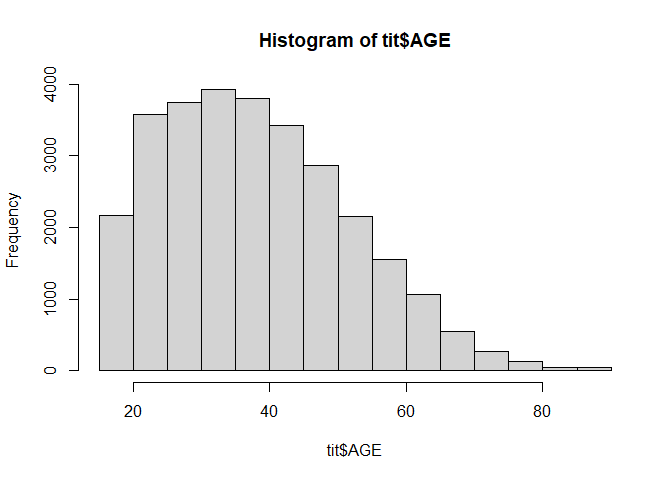
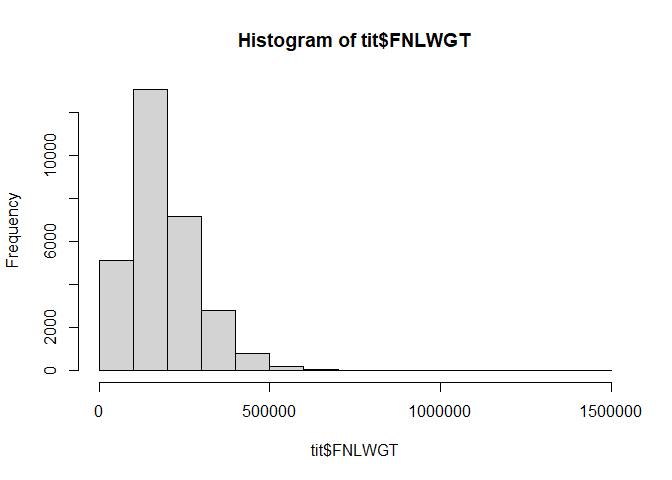
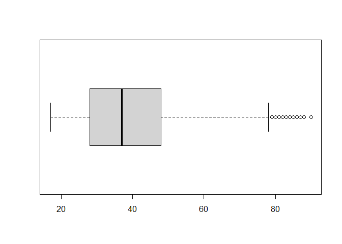
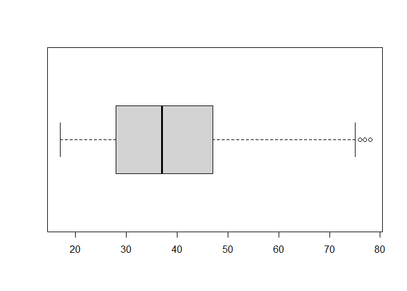
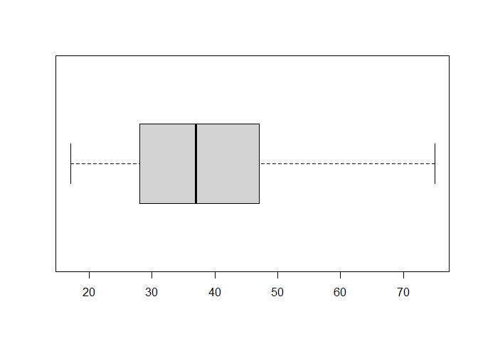

Ayudantia 3: Outliers
================

## Actividad Ayudantia 3: Javiera Bustos

Replicar el analisis de outliers, debes elegir uno de los dos csv
disponibles (pokemon o titanic) y realizar el analisis con algunas de
las variables numericas y realizar un pequeño analisis en relacion a los
datos encontrados como outliers (en caso de que eligas el csv del
titanic solo debes evaluar las columnas AGE y FNLWGT)

``` r
library(dplyr)
```

    ## 
    ## Attaching package: 'dplyr'

    ## The following objects are masked from 'package:stats':
    ## 
    ##     filter, lag

    ## The following objects are masked from 'package:base':
    ## 
    ##     intersect, setdiff, setequal, union

``` r
wd = setwd("C:/Users/Javiera/Desktop/RAMOS 2021/Minería/proyectos_mineria/Actividad_A3")

tit = read.csv("titanic.csv")
head(tit)
```

    ##   AGE WORKCLASS FNLWGT    EDUCATION EDUCATION.NUM     MARITAL.STATUS
    ## 1  49   Private 323798 Some-college            10           Divorced
    ## 2  29   Private 203833    Bachelors            13      Never-married
    ## 3  46 Local-gov 172822      HS-grad             9 Married-civ-spouse
    ## 4  17   Private  47425         11th             7      Never-married
    ## 5  49   Private 166789      HS-grad             9 Married-civ-spouse
    ## 6  28   Private 150309      HS-grad             9 Married-civ-spouse
    ##          OCCUPATION  RELATIONSHIP               RACE    SEX CAPITAL.GAIN
    ## 1   Exec-managerial Not-in-family              White   Male         3325
    ## 2    Prof-specialty Not-in-family              Black   Male            0
    ## 3  Transport-moving       Husband              White   Male            0
    ## 4     Other-service     Own-child              White Female            0
    ## 5      Adm-clerical       Husband              White   Male            0
    ## 6 Machine-op-inspct       Husband Amer-Indian-Eskimo   Male            0
    ##   CAPITAL.LOSS HOURS.PER.WEEK NATIVE.COUNTRY INCOME
    ## 1            0             50  United-States  <=50K
    ## 2            0             40  United-States  <=50K
    ## 3            0             40  United-States  <=50K
    ## 4            0             15  United-States  <=50K
    ## 5            0             40  United-States  <=50K
    ## 6            0             45  United-States  <=50K

## Limpieza de datos

Eliminar todas los campos que no se usarán en el análisis. Solo se
evaluará AGE y FNLWGT

``` r
tit <- subset(tit, select = c(AGE, FNLWGT))
head(tit)
```

    ##   AGE FNLWGT
    ## 1  49 323798
    ## 2  29 203833
    ## 3  46 172822
    ## 4  17  47425
    ## 5  49 166789
    ## 6  28 150309

## Histograma

Con el fin de tener una visión mas amplia de los datos, se realizarán 2
histogramas respectivos a las columnas AGE y FNLWGT

``` r
hist(tit$AGE)
```

<!-- -->

``` r
hist(tit$FNLWGT)
```

<!-- -->

Se procederá a analizar solo el campo AGE

## Creación de bloxplot (AGE)

Graficar la distribución de las edades

``` r
#attach(tit)

boxplot(tit$AGE, horizontal = TRUE)
```

<!-- -->

Ya es posible visibilizar a simple vista los datos outliers a la derecha

``` r
stats_att = boxplot.stats(tit$AGE)

stats_att
```

    ## $stats
    ## [1] 17 28 37 48 78
    ## 
    ## $n
    ## [1] 29286
    ## 
    ## $conf
    ## [1] 36.81535 37.18465
    ## 
    ## $out
    ##   [1] 90 90 90 82 80 84 90 90 90 90 83 80 84 90 84 81 83 90 82 80 82 81 79 84 84
    ##  [26] 84 80 81 79 90 80 85 81 82 90 80 79 79 81 90 81 83 79 80 79 79 90 90 81 82
    ##  [51] 80 84 87 90 82 82 88 80 90 79 90 90 90 90 80 90 80 80 90 81 90 90 80 90 81
    ##  [76] 79 81 79 82 90 90 81 80 86 82 90 79 90 82 80 90 90 90 79 90 88 90 79 80 79
    ## [101] 90 84 80 85 83 81 79 90 80 90 80 84 90 80 82 81 79 82 83 85 90 79 80 79 79
    ## [126] 90

Las estadísticas del boxplot arrojan que el outlier menor es 79 años y
el mayor 90 años.

## Segundo bloxplot

Segundo bloxpot sin considerar los outliers del análisis anterior

``` r
tit2_age <- tit$AGE[tit$AGE < 79]
#length(AGE) - length(tit2_age)

att2 = boxplot(tit2_age, horizontal = TRUE)
```

<!-- -->

``` r
stats_att = boxplot.stats(tit2_age)
stats_att
```

    ## $stats
    ## [1] 17 28 37 47 75
    ## 
    ## $n
    ## [1] 29160
    ## 
    ## $conf
    ## [1] 36.8242 37.1758
    ## 
    ## $out
    ##  [1] 78 78 76 78 76 76 76 76 77 77 77 78 76 76 77 77 76 78 77 78 77 77 76 76 77
    ## [26] 76 76 76 76 76 77 76 78 76 76 77 76 76 76 77 78 76 77 77 77 76 78 76 76 76
    ## [51] 77 76 76 77 78 78 77 76 78 77 76 77 78 78 77 77 77 77 76 76 76 76 76 77 76
    ## [76] 76 78 76 78 76 76 77 76 78 76 78 78 76

Ahora tenemos menos datos y outliers, el menor es 76. Volveremos a
generar nuevo bloxplot para seguir eliminando outliers

## Tercer bloxplot

``` r
tit3_age <- tit$AGE[tit$AGE < 76]
#length(AGE) - length(tit2_age)

att3 = boxplot(tit3_age, horizontal = TRUE)
```

<!-- -->

``` r
stats_att = boxplot.stats(tit3_age)
stats_att
```

    ## $stats
    ## [1] 17 28 37 47 75
    ## 
    ## $n
    ## [1] 29072
    ## 
    ## $conf
    ## [1] 36.82393 37.17607
    ## 
    ## $out
    ## integer(0)

Gracias a dios ya no es posible encontrar datos outliers. El análisis
nos arroja 29072 datos, y un intervalo de confianza \[36.82393
37.17607\]
