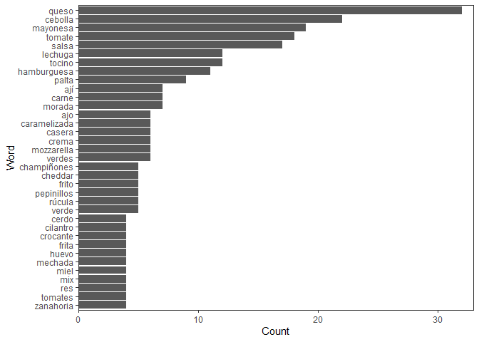
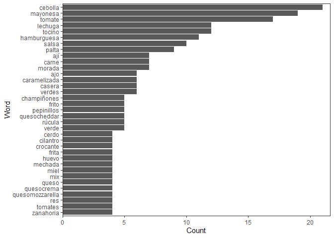

Proyecto 1: Analisis Sanguchez
================

### Alumna: Javiera Bustos Alvial

En el siguiente reporte se utilizará la base de datos sanguchez.csv, en
donde se almacen datos de las evaluaciones de distintos usuarios sobre
ciertos sandwiches, en las columnas encontramos: url, Local, Direccion,
Precio, Ingredientes, nota, texto. El objetivo es, basado en estos
datos, poder determinar cuales son los ingredientes que componen a los
sandwiches con mayor puntuación. Se utilizará el método “bag of words”,
de esta manera se generará un corpus de texto con los datos de la
columna ingredientes, tomando en cuenta aquellas filas que tienen nota
5. Posteriormente se limpiará el corpus con el fin de poder extraer solo
las palabras que sean ingredientes y luego se evaluarán las frecuencias
de estas palabras.  
El análisis se dividirá en tres partes: Carga de datos, limpieza de
datos, análisis de datos.  
Suposiciones: Aquellos sandwiches que tienen nota 5 son los mejores bajo
mi punto de vista, sin embargo otra persona podría describir a un
sandwich bueno como aquellos que tienen nota 4 o 5. Para este análisis
solo se supondrá que aquellos con nota 5 son los mejores. También se
supondrá que todo sandwich esta compuesto por pan, por lo tanto este no
será considerado como ingrediente.

## 1. Carga de datos

Carga de librerías necesarias

``` r
library(tidyverse)
library(readr)
library(qdap)
library(tm)
```

Cargar el csv desde la carpeta donde está guardada

``` r
data <- read.csv(file='C:/Users/Javiera/Documents/sanguchez.csv',sep=";")
```

Como los datos de interes son las notas e ingredientes, se eliminarán
las demás columnas ya que no son necesarias para el análisis.

``` r
data <- subset(data, select = -c(texto, url, Local, Direccion, Precio))
head(data)
```

    ##                                                                                                                  Ingredientes
    ## 1                                               Suprema de pollo dulce, espinaca, crema ácida, repollo avinagrado y guacamole
    ## 2                     Carne mechada en reducción de vino tinto, champiñones salteados, cebolla caramelizada y queso derretido
    ## 3                          Mayonesa al olivo, champiñones salteados, jalapeños, queso Mozzarella, papas hilo y cebolla morada
    ## 4                          Queso Mozzarella, Rúcula, Champiñon portobello relleno de cheddar y luego apanado en panko y frito
    ## 5 Tofu asado no transgénico, palta, tomate, champiñones, mix de hojas verdes orgánicas,  mayonesa de zanahoria vegana casera,
    ## 6                           Hamburguesa, queso Cheddar, cebolla caramelizada, berros, pepinillos y salsa Jack Daniel’s Honey.
    ##   nota
    ## 1    3
    ## 2    3
    ## 3    4
    ## 4    4
    ## 5    4
    ## 6    3

``` r
summary(data)
```

    ##  Ingredientes            nota      
    ##  Length:410         Min.   :1.000  
    ##  Class :character   1st Qu.:3.000  
    ##  Mode  :character   Median :3.000  
    ##                     Mean   :3.167  
    ##                     3rd Qu.:4.000  
    ##                     Max.   :5.000  
    ##                     NA's   :8

Aquí se pudo evidenciar un como se componen las dos columnas de datos,
una linea de strings que contienen los ingredientes y sus respectivas
notas. Además con summary() se puede apreciar que hay varias notas
Nulas, específciamente 8 datos NA’s, ya que solo necesitamos conocer
aquellas respuestas que posean nota, se deberán eliminar aquellas que no
tengan nota.

## 2. Limpieza de datos

Summary indica que hay notas NA, estos datos no sirve entonces se
eliminan. Como solo nos interesa analizar aquellos sandwiches que tienen
nota 5, se eliminarán datos que posean nota menor a 5.

``` r
data <- data[complete.cases(data), ]
data <- filter(data, nota==5)
head(data)
```

    ##                                                                                                       Ingredientes
    ## 1        Pato, queso Pepper Jack, jalapeños, cebolla morada, espinaca, tomate y mayonesa Habanero, en pan Brioche.
    ## 2 Hamburguesa, Queso americano, Tocino glaseado con miel de maple, Alioli con miel de maple, Poutine, Pan de leche
    ## 3                       Carne, zucchini grillado con un toque de ajo, pimentón acaramelado, champiñones y ricotta.
    ## 4         Filete de res, con relish de betarraga, raíz picante (rábano), aros de cebolla y champiñones Portobellos
    ## 5              Zapallo japonés rostizado, Mayonesa al chilli, Rúcula, Garbanzos, Queso grana padano, Pan focaccia.
    ## 6   Hamburguesa 50% carne y 50% prieta, queso parmesano, manzana verde caramelizada, palta, rúcula y salsa al ajo.
    ##   nota
    ## 1    5
    ## 2    5
    ## 3    5
    ## 4    5
    ## 5    5
    ## 6    5

Ahora se eliminarán las columnas innecesarias, como solo interesan los
ingredientes, se dejará solo la columna Ingredientes y se almacenarán en
la variable ing\_text

``` r
ing_text <- data$Ingredientes
```

Para generar el corpus de texto con el fin de crear la bolsa de
palabras, debemos unir toda la columna de ingredientes en un solo texto,
para esto se deberá crear un vector con la funcion VectorSource y luego
el corpus con la funcion VCorpus. Se imprime un dato como ejemplo para
visualizar parte del contenido del corpus.

``` r
ing_source <- VectorSource(ing_text)
corpus_ing <- VCorpus(ing_source)
#copia para posterior comparaciones
corpuscopy <- corpus_ing
#un vistaza a como se ve el corpus
corpus_ing[[1]]$content
```

    ## [1] "Pato, queso Pepper Jack, jalapeños, cebolla morada, espinaca, tomate y mayonesa Habanero, en pan Brioche."

Siguiendo con la limpieza, ahora se eliminarán caracteres y palabras que
no aportan al análisis, como spanish stopwords, mayusculas, numeros,
signos de puntuacion y otras palabras no relevantes. Para esto se creará
una función llamada clean\_corpus. Aquí tambien se elimina la palabra
pan, ya que este no será considerado como ingrediente.

``` r
clean_corpus <- function(corpus){
  corpus <- tm_map(corpus, removeNumbers)
  corpus <- tm_map(corpus, removePunctuation)
  corpus <- tm_map(corpus, content_transformer(tolower))
  corpus <- tm_map(corpus, removeWords, stopwords("spanish"))
  corpus <- tm_map(corpus, removeWords, "pan")
  return(corpus)
}

corpus_ing <- clean_corpus(corpus_ing)

corpus_ing[[1]]$content
```

    ## [1] "pato queso pepper jack jalapeños cebolla morada espinaca tomate  mayonesa habanero   brioche"

Al visualizar un elemento del corpus es posible apreciar la diferencia
con la visualización anterior. Ya no encontramos signos de puntuación,
maýusculas, conectores, etc.

## 3. Primer análisis

Para poder visualizar los datos que tenemos hasta el momento se
transformará el corpus en dataframe para luego calcular la frecuencia de
palabras y graficar, con el fin de poder tener una primera apreciación
de los datos

``` r
#
corp_text <- as.data.frame(corpus_ing)
(frequent_terms <- freq_terms(corp_text,top = 30))
```

    ##    WORD         FREQ
    ## 1  queso          32
    ## 2  cebolla        22
    ## 3  mayonesa       19
    ## 4  tomate         18
    ## 5  salsa          17
    ## 6  lechuga        12
    ## 7  tocino         12
    ## 8  hamburguesa    11
    ## 9  palta           9
    ## 10 ají             7
    ## 11 carne           7
    ## 12 morada          7
    ## 13 ajo             6
    ## 14 caramelizada    6
    ## 15 casera          6
    ## 16 crema           6
    ## 17 mozzarella      6
    ## 18 verdes          6
    ## 19 champiñones     5
    ## 20 cheddar         5
    ## 21 frito           5
    ## 22 pepinillos      5
    ## 23 rúcula          5
    ## 24 verde           5
    ## 25 cerdo           4
    ## 26 cilantro        4
    ## 27 crocante        4
    ## 28 frita           4
    ## 29 huevo           4
    ## 30 mechada         4
    ## 31 miel            4
    ## 32 mix             4
    ## 33 res             4
    ## 34 tomates         4
    ## 35 zanahoria       4

``` r
plot(frequent_terms)
```



Hay palabras que no son ingredientes sino que adjetivos, ejemplo:
mozzarella viene de queso mozzarella, quesos es lo mismo que queso,
cheddar es queso cheddar.

## 4. Segunda limpieza

Como se puede ver en el análisis anterior hay juegos de palabras que
deberán considerarse como 1 sola, lo haremos con queso y salsa, ya que
en el caso de la cebolla son demasiadas las variables de adjetivos para
esta y el proceso de limpieza era más complejo.

``` r
corpus_ing <- tm_map(corpus_ing, content_transformer(function(x) gsub("(queso).(\\w+)", "\\1\\2", x, ignore.case = TRUE)))
corpus_ing <- tm_map(corpus_ing, content_transformer(function(x) gsub("(salsa).(\\w+)", "\\1\\2", x, ignore.case = TRUE)))
corp_text <- as.data.frame(corpus_ing)
(frequent_terms <- freq_terms(corp_text,top = 30))
```

    ##    WORD            FREQ
    ## 1  cebolla           21
    ## 2  mayonesa          19
    ## 3  tomate            17
    ## 4  lechuga           12
    ## 5  tocino            12
    ## 6  hamburguesa       11
    ## 7  salsa             10
    ## 8  palta              9
    ## 9  ají                7
    ## 10 carne              7
    ## 11 morada             7
    ## 12 ajo                6
    ## 13 caramelizada       6
    ## 14 casera             6
    ## 15 verdes             6
    ## 16 champiñones        5
    ## 17 frito              5
    ## 18 pepinillos         5
    ## 19 quesocheddar       5
    ## 20 rúcula             5
    ## 21 verde              5
    ## 22 cerdo              4
    ## 23 cilantro           4
    ## 24 crocante           4
    ## 25 frita              4
    ## 26 huevo              4
    ## 27 mechada            4
    ## 28 miel               4
    ## 29 mix                4
    ## 30 queso              4
    ## 31 quesocrema         4
    ## 32 quesomozzarella    4
    ## 33 res                4
    ## 34 tomates            4
    ## 35 zanahoria          4

``` r
plot(frequent_terms)
```



Despues de esta limpieza ya podemos ver los ingredientes con mayor
frecuencia más claramente, aun así hay algunos errores que se podrían
corregir.

## 5 Análisis final y conclusiones

Partiendo de la suposición de que un sandwich esta compuesto por
alrededer de 5 ingredientes, se extraerán los 5 ingredientes con mayor
frecuencia de la bolsa de palabras.

``` r
(frequent_terms_final <- freq_terms(corp_text,5))
```

    ##   WORD     FREQ
    ## 1 cebolla    21
    ## 2 mayonesa   19
    ## 3 tomate     17
    ## 4 lechuga    12
    ## 5 tocino     12

Dado que analizamos los datos de solamente aquellos sandwiches que
obtuvieron la mayor nota, podríamos inferir que aquellos ingredientes
con mayor frecuencia son los que forman un buen sandwich. concluyendo
así que: **Los ingredientes ideales son: CEBOLLA (21), MAYONESA (19),
TOMATE (17), LECHUGA (12) y TOCINO (12).**

Si lo comparamos con la realidad, es muy similar, todos los restaurantes
de comida rápida tienen en sus menus algun sandwich con una combinación
similar. Aun así, hay varias cosas que podrían mejorarse en el análisis
siendo estas: \* Considerar aquellos sandwiches que tengan nota 4, ya
que también puede ser considerada una nota alta \* Lograr separar a las
variantes de cebolla en el corpus, ya que hay varios tipos de cebolla \*
Como hay muchos adjetivos de los ingredientes (ej: frita, morada,
caramelizada, crocante, casera), buscar la forma de crear unirlas a la
palabra ingrediente y así conformar el ingrediente más específico. \*
Buscar correlación entre ingredientes.
