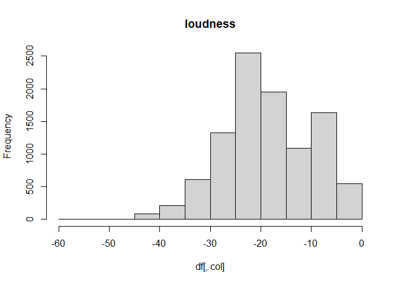

Proyecto 2
================

``` r
library(tidyverse)
```

    ## -- Attaching packages --------------------------------------- tidyverse 1.3.0 --

    ## v ggplot2 3.3.3     v purrr   0.3.4
    ## v tibble  3.1.0     v dplyr   1.0.5
    ## v tidyr   1.1.3     v stringr 1.4.0
    ## v readr   1.4.0     v forcats 0.5.1

    ## -- Conflicts ------------------------------------------ tidyverse_conflicts() --
    ## x dplyr::filter() masks stats::filter()
    ## x dplyr::lag()    masks stats::lag()

``` r
library(dplyr)
library(corrplot)
```

    ## Warning: package 'corrplot' was built under R version 4.0.5

    ## corrplot 0.84 loaded

``` r
library(scales)
```

    ## 
    ## Attaching package: 'scales'

    ## The following object is masked from 'package:purrr':
    ## 
    ##     discard

    ## The following object is masked from 'package:readr':
    ## 
    ##     col_factor

``` r
library(cluster)
library(factoextra)
```

    ## Warning: package 'factoextra' was built under R version 4.0.5

    ## Welcome! Want to learn more? See two factoextra-related books at https://goo.gl/ve3WBa

``` r
load("beats.Rdata")

head(beats)
```

    ##   artist_name              artist_id               album_id album_type
    ## 1        2Pac 1ZwdS5xdxEREPySFridCfh 1nGbXgS6toEOcFCDwEl5R3      album
    ## 2        2Pac 1ZwdS5xdxEREPySFridCfh 1nGbXgS6toEOcFCDwEl5R3      album
    ## 3        2Pac 1ZwdS5xdxEREPySFridCfh 1nGbXgS6toEOcFCDwEl5R3      album
    ## 4        2Pac 1ZwdS5xdxEREPySFridCfh 1nGbXgS6toEOcFCDwEl5R3      album
    ## 5        2Pac 1ZwdS5xdxEREPySFridCfh 1nGbXgS6toEOcFCDwEl5R3      album
    ## 6        2Pac 1ZwdS5xdxEREPySFridCfh 1nGbXgS6toEOcFCDwEl5R3      album
    ##   album_release_date album_release_year album_release_date_precision
    ## 1         2019-08-01               2019                          day
    ## 2         2019-08-01               2019                          day
    ## 3         2019-08-01               2019                          day
    ## 4         2019-08-01               2019                          day
    ## 5         2019-08-01               2019                          day
    ## 6         2019-08-01               2019                          day
    ##   danceability energy key loudness mode speechiness acousticness
    ## 1        0.656  0.882   0   -3.011    1      0.0941      0.03300
    ## 2        0.810  0.642   8   -8.647    1      0.2440      0.04800
    ## 3        0.548  0.590   4   -9.301    0      0.4750      0.11300
    ## 4        0.839  0.657   5   -4.959    0      0.2220      0.05260
    ## 5        0.854  0.694   0   -4.258    0      0.1230      0.00944
    ## 6        0.697  0.598   2   -9.604    1      0.1360      0.00522
    ##   instrumentalness liveness valence   tempo               track_id
    ## 1         0.000000   0.6700   0.782  91.661 6ayeqYtOtwVhqVB6k6MKoh
    ## 2         0.000000   0.2640   0.694  90.956 1UDsnzBp8gUCFsrzUDlZI9
    ## 3         0.000722   0.2290   0.267  87.841 3bKs15o7F9VP6GBExCbb6H
    ## 4         0.000106   0.3910   0.615  85.111 4L0iAst3yLonw8aGxTRCvb
    ## 5         0.071900   0.0767   0.776 104.379 66men3J5qFERvIY06M5hQ9
    ## 6         0.000000   0.1720   0.387  85.862 7GVCAVH7SZnjrzHI1FmfeA
    ##                                                       analysis_url
    ## 1 https://api.spotify.com/v1/audio-analysis/6ayeqYtOtwVhqVB6k6MKoh
    ## 2 https://api.spotify.com/v1/audio-analysis/1UDsnzBp8gUCFsrzUDlZI9
    ## 3 https://api.spotify.com/v1/audio-analysis/3bKs15o7F9VP6GBExCbb6H
    ## 4 https://api.spotify.com/v1/audio-analysis/4L0iAst3yLonw8aGxTRCvb
    ## 5 https://api.spotify.com/v1/audio-analysis/66men3J5qFERvIY06M5hQ9
    ## 6 https://api.spotify.com/v1/audio-analysis/7GVCAVH7SZnjrzHI1FmfeA
    ##   time_signature disc_number duration_ms explicit
    ## 1              4           1      347973    FALSE
    ## 2              4           1      241026    FALSE
    ## 3              4           1      240013    FALSE
    ## 4              4           1      295026    FALSE
    ## 5              4           1      241000    FALSE
    ## 6              4           1      224026    FALSE
    ##                                                 track_href is_local
    ## 1 https://api.spotify.com/v1/tracks/6ayeqYtOtwVhqVB6k6MKoh    FALSE
    ## 2 https://api.spotify.com/v1/tracks/1UDsnzBp8gUCFsrzUDlZI9    FALSE
    ## 3 https://api.spotify.com/v1/tracks/3bKs15o7F9VP6GBExCbb6H    FALSE
    ## 4 https://api.spotify.com/v1/tracks/4L0iAst3yLonw8aGxTRCvb    FALSE
    ## 5 https://api.spotify.com/v1/tracks/66men3J5qFERvIY06M5hQ9    FALSE
    ## 6 https://api.spotify.com/v1/tracks/7GVCAVH7SZnjrzHI1FmfeA    FALSE
    ##               track_name
    ## 1        California Love
    ## 2 Slippin' Into Darkness
    ## 3            Ride or Die
    ## 4     I Ain't Mad At Cha
    ## 5              Static II
    ## 6                Runnin'
    ##                                                                                             track_preview_url
    ## 1 https://p.scdn.co/mp3-preview/93e456ef0b73f23f50eeadaeaad852d79d4f4610?cid=ac26d97eca664234ab133e5208ea5737
    ## 2 https://p.scdn.co/mp3-preview/440595604d3f49464bcf28efc867f7df31d62e53?cid=ac26d97eca664234ab133e5208ea5737
    ## 3 https://p.scdn.co/mp3-preview/cc18dc90d609d37591e5993615a0cea1fa25f428?cid=ac26d97eca664234ab133e5208ea5737
    ## 4 https://p.scdn.co/mp3-preview/d138f0170423cd9a14f31006d4add57c07f705c4?cid=ac26d97eca664234ab133e5208ea5737
    ## 5 https://p.scdn.co/mp3-preview/dddb7d0ea0205338a00c591e6045b0c21cd7c9fc?cid=ac26d97eca664234ab133e5208ea5737
    ## 6 https://p.scdn.co/mp3-preview/fc169c99acc9d8bb19b34cf1aaad9f1b0b9b68e8?cid=ac26d97eca664234ab133e5208ea5737
    ##   track_number  type                            track_uri
    ## 1            1 track spotify:track:6ayeqYtOtwVhqVB6k6MKoh
    ## 2            2 track spotify:track:1UDsnzBp8gUCFsrzUDlZI9
    ## 3            3 track spotify:track:3bKs15o7F9VP6GBExCbb6H
    ## 4            4 track spotify:track:4L0iAst3yLonw8aGxTRCvb
    ## 5            5 track spotify:track:66men3J5qFERvIY06M5hQ9
    ## 6            6 track spotify:track:7GVCAVH7SZnjrzHI1FmfeA
    ##                                   external_urls.spotify      album_name
    ## 1 https://open.spotify.com/track/6ayeqYtOtwVhqVB6k6MKoh California Love
    ## 2 https://open.spotify.com/track/1UDsnzBp8gUCFsrzUDlZI9 California Love
    ## 3 https://open.spotify.com/track/3bKs15o7F9VP6GBExCbb6H California Love
    ## 4 https://open.spotify.com/track/4L0iAst3yLonw8aGxTRCvb California Love
    ## 5 https://open.spotify.com/track/66men3J5qFERvIY06M5hQ9 California Love
    ## 6 https://open.spotify.com/track/7GVCAVH7SZnjrzHI1FmfeA California Love
    ##   key_name mode_name key_mode
    ## 1        C     major  C major
    ## 2       G#     major G# major
    ## 3        E     minor  E minor
    ## 4        F     minor  F minor
    ## 5        C     minor  C minor
    ## 6        D     major  D major

``` r
set.seed(123)
beats_copy <- sample_n(beats, 20000)
beats <- sample_n(beats, 10000)
```

# Comprension de los datos

El dataset contiene 447662 canciones y 36 variables. Sin embargo, dado a
que no se posee una máquina con tan alta capacidad se realizará el
analisis con 10.000 datos

Entre las variables es posible encontrar: Acousticness, Danceability,
Energy, Instrumentalness, Liveness, Loudness, Speechiness, Valence,
Tempo, entre otras.

### Suposiciones

## Limpieza y comprensión de datos

Comenzaremos visualizando las variables y la data que estas contienen.

``` r
glimpse(beats)
```

    ## Rows: 10,000
    ## Columns: 36
    ## $ artist_name                  <chr> "Childish Gambino", "Violeta Parra", "Joh~
    ## $ artist_id                    <chr> "73sIBHcqh3Z3NyqHKZ7FOL", "4ejp2yEDQIIJIy~
    ## $ album_id                     <chr> "5dVKggb6Nvfp7JJdLfHPof", "3eEjTdiJjcdWCh~
    ## $ album_type                   <chr> "album", "album", "album", "album", "albu~
    ## $ album_release_date           <chr> "2014-10-03", "2009-12-02", "2020-11-16",~
    ## $ album_release_year           <dbl> 2014, 2009, 2020, 2014, 2020, 2013, 2015,~
    ## $ album_release_date_precision <chr> "day", "day", "day", "day", "day", "day",~
    ## $ danceability                 <dbl> 0.7010, 0.6830, 0.5650, 0.1730, 0.3580, 0~
    ## $ energy                       <dbl> 0.5920, 0.1770, 0.1480, 0.0130, 0.0406, 0~
    ## $ key                          <int> 0, 10, 2, 3, 7, 10, 0, 5, 0, 1, 7, 3, 11,~
    ## $ loudness                     <dbl> -6.646, -6.766, -25.963, -31.026, -29.035~
    ## $ mode                         <int> 1, 1, 1, 1, 1, 1, 1, 0, 1, 1, 1, 1, 0, 1,~
    ## $ speechiness                  <dbl> 0.0301, 0.0400, 0.0822, 0.0378, 0.0374, 0~
    ## $ acousticness                 <dbl> 0.10100, 0.98400, 0.98400, 0.99500, 0.994~
    ## $ instrumentalness             <dbl> 2.53e-05, 1.71e-06, 8.85e-01, 8.23e-01, 8~
    ## $ liveness                     <dbl> 0.5510, 0.1020, 0.1070, 0.1340, 0.1160, 0~
    ## $ valence                      <dbl> 0.4210, 0.1760, 0.6690, 0.0395, 0.3220, 0~
    ## $ tempo                        <dbl> 98.067, 99.993, 121.970, 126.148, 111.515~
    ## $ track_id                     <chr> "7JRxU6iBw0nsgdnDlfBgP0", "2HGs7mFZOF1kGw~
    ## $ analysis_url                 <chr> "https://api.spotify.com/v1/audio-analysi~
    ## $ time_signature               <int> 4, 4, 4, 4, 4, 4, 4, 4, 4, 3, 4, 3, 1, 5,~
    ## $ disc_number                  <int> 1, 1, 1, 2, 1, 1, 1, 1, 1, 1, 1, 1, 1, 1,~
    ## $ duration_ms                  <int> 252013, 201245, 194973, 209253, 109000, 7~
    ## $ explicit                     <lgl> FALSE, FALSE, FALSE, FALSE, FALSE, FALSE,~
    ## $ track_href                   <chr> "https://api.spotify.com/v1/tracks/7JRxU6~
    ## $ is_local                     <lgl> FALSE, FALSE, FALSE, FALSE, FALSE, FALSE,~
    ## $ track_name                   <chr> "Sober", "Entre Aquel Apostolado", "Suite~
    ## $ track_preview_url            <chr> "https://p.scdn.co/mp3-preview/0d23a751ce~
    ## $ track_number                 <int> 1, 16, 460, 18, 40, 9, 8, 2, 4, 7, 72, 7,~
    ## $ type                         <chr> "track", "track", "track", "track", "trac~
    ## $ track_uri                    <chr> "spotify:track:7JRxU6iBw0nsgdnDlfBgP0", "~
    ## $ external_urls.spotify        <chr> "https://open.spotify.com/track/7JRxU6iBw~
    ## $ album_name                   <chr> "Kauai", "Canto Popular de Chile", "Essen~
    ## $ key_name                     <chr> "C", "A#", "D", "D#", "G", "A#", "C", "F"~
    ## $ mode_name                    <chr> "major", "major", "major", "major", "majo~
    ## $ key_mode                     <chr> "C major", "A# major", "D major", "D# maj~

Se puede apreciar que hay varias variables númericas que serán utiles
mientras que hay otras alfanumericas que solo sirve para reconocer la
canción y no entregarán datos importantes en el análisis, tales como
track\_uri, track\_preview\_url, album\_id, entre otras.

Continuaremos chequeando la existencia de NAs y eliminando en caso de
que existan

``` r
colSums(is.na(beats))
```

    ##                  artist_name                    artist_id 
    ##                            0                            0 
    ##                     album_id                   album_type 
    ##                            0                            0 
    ##           album_release_date           album_release_year 
    ##                            0                            9 
    ## album_release_date_precision                 danceability 
    ##                            0                            0 
    ##                       energy                          key 
    ##                            0                            0 
    ##                     loudness                         mode 
    ##                            0                            0 
    ##                  speechiness                 acousticness 
    ##                            0                            0 
    ##             instrumentalness                     liveness 
    ##                            0                            0 
    ##                      valence                        tempo 
    ##                            0                            0 
    ##                     track_id                 analysis_url 
    ##                            0                            0 
    ##               time_signature                  disc_number 
    ##                            0                            0 
    ##                  duration_ms                     explicit 
    ##                            0                            0 
    ##                   track_href                     is_local 
    ##                            0                            0 
    ##                   track_name            track_preview_url 
    ##                            0                         3951 
    ##                 track_number                         type 
    ##                            0                            0 
    ##                    track_uri        external_urls.spotify 
    ##                            0                            0 
    ##                   album_name                     key_name 
    ##                            0                            0 
    ##                    mode_name                     key_mode 
    ##                            0                            0

Encontramos algunos NAs pero como track\_preview\_url,
album\_release\_year, key\_mode no son variables importantes las
eliminaremos.

Continuaremos eliminado duplicados, tomando en cuenta que track\_id debe
ser único usaremos esta variable para reconocer los duplicados.

``` r
beats <- subset(beats, select = -c(track_preview_url, album_release_year, key_mode))
beats <- beats[!duplicated(beats$track_id),]
glimpse(beats)
```

    ## Rows: 9,999
    ## Columns: 33
    ## $ artist_name                  <chr> "Childish Gambino", "Violeta Parra", "Joh~
    ## $ artist_id                    <chr> "73sIBHcqh3Z3NyqHKZ7FOL", "4ejp2yEDQIIJIy~
    ## $ album_id                     <chr> "5dVKggb6Nvfp7JJdLfHPof", "3eEjTdiJjcdWCh~
    ## $ album_type                   <chr> "album", "album", "album", "album", "albu~
    ## $ album_release_date           <chr> "2014-10-03", "2009-12-02", "2020-11-16",~
    ## $ album_release_date_precision <chr> "day", "day", "day", "day", "day", "day",~
    ## $ danceability                 <dbl> 0.7010, 0.6830, 0.5650, 0.1730, 0.3580, 0~
    ## $ energy                       <dbl> 0.5920, 0.1770, 0.1480, 0.0130, 0.0406, 0~
    ## $ key                          <int> 0, 10, 2, 3, 7, 10, 0, 5, 0, 1, 7, 3, 11,~
    ## $ loudness                     <dbl> -6.646, -6.766, -25.963, -31.026, -29.035~
    ## $ mode                         <int> 1, 1, 1, 1, 1, 1, 1, 0, 1, 1, 1, 1, 0, 1,~
    ## $ speechiness                  <dbl> 0.0301, 0.0400, 0.0822, 0.0378, 0.0374, 0~
    ## $ acousticness                 <dbl> 0.10100, 0.98400, 0.98400, 0.99500, 0.994~
    ## $ instrumentalness             <dbl> 2.53e-05, 1.71e-06, 8.85e-01, 8.23e-01, 8~
    ## $ liveness                     <dbl> 0.5510, 0.1020, 0.1070, 0.1340, 0.1160, 0~
    ## $ valence                      <dbl> 0.4210, 0.1760, 0.6690, 0.0395, 0.3220, 0~
    ## $ tempo                        <dbl> 98.067, 99.993, 121.970, 126.148, 111.515~
    ## $ track_id                     <chr> "7JRxU6iBw0nsgdnDlfBgP0", "2HGs7mFZOF1kGw~
    ## $ analysis_url                 <chr> "https://api.spotify.com/v1/audio-analysi~
    ## $ time_signature               <int> 4, 4, 4, 4, 4, 4, 4, 4, 4, 3, 4, 3, 1, 5,~
    ## $ disc_number                  <int> 1, 1, 1, 2, 1, 1, 1, 1, 1, 1, 1, 1, 1, 1,~
    ## $ duration_ms                  <int> 252013, 201245, 194973, 209253, 109000, 7~
    ## $ explicit                     <lgl> FALSE, FALSE, FALSE, FALSE, FALSE, FALSE,~
    ## $ track_href                   <chr> "https://api.spotify.com/v1/tracks/7JRxU6~
    ## $ is_local                     <lgl> FALSE, FALSE, FALSE, FALSE, FALSE, FALSE,~
    ## $ track_name                   <chr> "Sober", "Entre Aquel Apostolado", "Suite~
    ## $ track_number                 <int> 1, 16, 460, 18, 40, 9, 8, 2, 4, 7, 72, 7,~
    ## $ type                         <chr> "track", "track", "track", "track", "trac~
    ## $ track_uri                    <chr> "spotify:track:7JRxU6iBw0nsgdnDlfBgP0", "~
    ## $ external_urls.spotify        <chr> "https://open.spotify.com/track/7JRxU6iBw~
    ## $ album_name                   <chr> "Kauai", "Canto Popular de Chile", "Essen~
    ## $ key_name                     <chr> "C", "A#", "D", "D#", "G", "A#", "C", "F"~
    ## $ mode_name                    <chr> "major", "major", "major", "major", "majo~

Quedamos con 33 variables y 9,998 datos

Nos enfocaremos solo en las variables caracteristicas (features) de cada
canción, en este caso son 10:

“energy”, “speechiness”, “acousticness”, “instrumentalness”,
“loudness”,“tempo”,“danceability”,‘valence’ , “liveness”, “key” Además
de conservar el track\_id y duration\_ms

``` r
beats <- subset(beats, select = -c(artist_name, artist_id, album_id, album_type, album_release_date,
                                   album_release_date_precision, analysis_url, time_signature, 
                                   disc_number, explicit, track_href, is_local, track_name, type,
                                   track_uri, external_urls.spotify, album_name, key_name, mode_name, 
                                   track_number, mode))

glimpse(beats)
```

    ## Rows: 9,999
    ## Columns: 12
    ## $ danceability     <dbl> 0.7010, 0.6830, 0.5650, 0.1730, 0.3580, 0.3790, 0.102~
    ## $ energy           <dbl> 0.5920, 0.1770, 0.1480, 0.0130, 0.0406, 0.2230, 0.029~
    ## $ key              <int> 0, 10, 2, 3, 7, 10, 0, 5, 0, 1, 7, 3, 11, 4, 5, 1, 10~
    ## $ loudness         <dbl> -6.646, -6.766, -25.963, -31.026, -29.035, -17.828, -~
    ## $ speechiness      <dbl> 0.0301, 0.0400, 0.0822, 0.0378, 0.0374, 0.0354, 0.044~
    ## $ acousticness     <dbl> 0.10100, 0.98400, 0.98400, 0.99500, 0.99400, 0.98900,~
    ## $ instrumentalness <dbl> 2.53e-05, 1.71e-06, 8.85e-01, 8.23e-01, 8.94e-01, 8.5~
    ## $ liveness         <dbl> 0.5510, 0.1020, 0.1070, 0.1340, 0.1160, 0.0426, 0.106~
    ## $ valence          <dbl> 0.4210, 0.1760, 0.6690, 0.0395, 0.3220, 0.0984, 0.029~
    ## $ tempo            <dbl> 98.067, 99.993, 121.970, 126.148, 111.515, 96.029, 76~
    ## $ track_id         <chr> "7JRxU6iBw0nsgdnDlfBgP0", "2HGs7mFZOF1kGw4m5hu7Xu", "~
    ## $ duration_ms      <int> 252013, 201245, 194973, 209253, 109000, 777131, 49129~

Ahora tenemos 12 variables.  
Ya que duration ms está en ms lo transformaremos en minutos
(duration\_min), esto nos ayudará posteriormente.

``` r
beats <- beats %>% mutate (duration_min = duration_ms/60000)
beats <- subset(beats, select = -c(duration_ms))
#beats_copy <- beats
glimpse(beats)
```

    ## Rows: 9,999
    ## Columns: 12
    ## $ danceability     <dbl> 0.7010, 0.6830, 0.5650, 0.1730, 0.3580, 0.3790, 0.102~
    ## $ energy           <dbl> 0.5920, 0.1770, 0.1480, 0.0130, 0.0406, 0.2230, 0.029~
    ## $ key              <int> 0, 10, 2, 3, 7, 10, 0, 5, 0, 1, 7, 3, 11, 4, 5, 1, 10~
    ## $ loudness         <dbl> -6.646, -6.766, -25.963, -31.026, -29.035, -17.828, -~
    ## $ speechiness      <dbl> 0.0301, 0.0400, 0.0822, 0.0378, 0.0374, 0.0354, 0.044~
    ## $ acousticness     <dbl> 0.10100, 0.98400, 0.98400, 0.99500, 0.99400, 0.98900,~
    ## $ instrumentalness <dbl> 2.53e-05, 1.71e-06, 8.85e-01, 8.23e-01, 8.94e-01, 8.5~
    ## $ liveness         <dbl> 0.5510, 0.1020, 0.1070, 0.1340, 0.1160, 0.0426, 0.106~
    ## $ valence          <dbl> 0.4210, 0.1760, 0.6690, 0.0395, 0.3220, 0.0984, 0.029~
    ## $ tempo            <dbl> 98.067, 99.993, 121.970, 126.148, 111.515, 96.029, 76~
    ## $ track_id         <chr> "7JRxU6iBw0nsgdnDlfBgP0", "2HGs7mFZOF1kGw4m5hu7Xu", "~
    ## $ duration_min     <dbl> 4.2002167, 3.3540833, 3.2495500, 3.4875500, 1.8166667~

## Exploración de la data

Para generar un análisis preliminar y comprender la data, generaremos un
histograma de todas las variables menos track\_id y duration\_min

``` r
df <- subset(beats, select = -c(track_id, duration_min))
for (col in 1:ncol(df)) {
    hist(df[,col], main = names(df[col]))
}
```

<!-- --><!-- --><!-- --><!-- --><!-- --><!-- --><!-- --><!-- --><!-- --><!-- -->
Aquí podemos visualizar que no todos los datos están en el rango
\[0,1\]. Por lo tanto las variables que no están en este rango serán
normalizadas: key, loudness y tempo serán normalizadas

``` r
beats$key <- rescale(beats$key)
beats$loudness <- rescale(beats$loudness)
beats$tempo <- rescale(beats$tempo)

glimpse(beats)
```

    ## Rows: 9,999
    ## Columns: 12
    ## $ danceability     <dbl> 0.7010, 0.6830, 0.5650, 0.1730, 0.3580, 0.3790, 0.102~
    ## $ energy           <dbl> 0.5920, 0.1770, 0.1480, 0.0130, 0.0406, 0.2230, 0.029~
    ## $ key              <dbl> 0.00000000, 0.90909091, 0.18181818, 0.27272727, 0.636~
    ## $ loudness         <dbl> 0.9026986, 0.9006683, 0.5758734, 0.4902123, 0.5238981~
    ## $ speechiness      <dbl> 0.0301, 0.0400, 0.0822, 0.0378, 0.0374, 0.0354, 0.044~
    ## $ acousticness     <dbl> 0.10100, 0.98400, 0.98400, 0.99500, 0.99400, 0.98900,~
    ## $ instrumentalness <dbl> 2.53e-05, 1.71e-06, 8.85e-01, 8.23e-01, 8.94e-01, 8.5~
    ## $ liveness         <dbl> 0.5510, 0.1020, 0.1070, 0.1340, 0.1160, 0.0426, 0.106~
    ## $ valence          <dbl> 0.4210, 0.1760, 0.6690, 0.0395, 0.3220, 0.0984, 0.029~
    ## $ tempo            <dbl> 0.4563293, 0.4652915, 0.5675557, 0.5869970, 0.5189061~
    ## $ track_id         <chr> "7JRxU6iBw0nsgdnDlfBgP0", "2HGs7mFZOF1kGw4m5hu7Xu", "~
    ## $ duration_min     <dbl> 4.2002167, 3.3540833, 3.2495500, 3.4875500, 1.8166667~

``` r
summary(beats)
```

    ##   danceability        energy            key            loudness     
    ##  Min.   :0.0000   Min.   :0.0000   Min.   :0.0000   Min.   :0.0000  
    ##  1st Qu.:0.2520   1st Qu.:0.0752   1st Qu.:0.1818   1st Qu.:0.6016  
    ##  Median :0.3700   Median :0.2100   Median :0.4545   Median :0.6847  
    ##  Mean   :0.3915   Mean   :0.3404   Mean   :0.4620   Mean   :0.6995  
    ##  3rd Qu.:0.5160   3rd Qu.:0.5870   3rd Qu.:0.7273   3rd Qu.:0.8215  
    ##  Max.   :0.9670   Max.   :1.0000   Max.   :1.0000   Max.   :1.0000  
    ##   speechiness       acousticness    instrumentalness      liveness     
    ##  Min.   :0.00000   Min.   :0.0000   Min.   :0.000000   Min.   :0.0000  
    ##  1st Qu.:0.03775   1st Qu.:0.3675   1st Qu.:0.001795   1st Qu.:0.0966  
    ##  Median :0.04430   Median :0.9240   Median :0.701000   Median :0.1210  
    ##  Mean   :0.06856   Mean   :0.6961   Mean   :0.502498   Mean   :0.2189  
    ##  3rd Qu.:0.05840   3rd Qu.:0.9860   3rd Qu.:0.900000   3rd Qu.:0.2450  
    ##  Max.   :0.96600   Max.   :0.9960   Max.   :0.999000   Max.   :1.0000  
    ##     valence            tempo          track_id          duration_min     
    ##  Min.   :0.00000   Min.   :0.0000   Length:9999        Min.   : 0.01777  
    ##  1st Qu.:0.09255   1st Qu.:0.3840   Class :character   1st Qu.: 2.02255  
    ##  Median :0.27200   Median :0.4907   Mode  :character   Median : 3.27155  
    ##  Mean   :0.34098   Mean   :0.5065                      Mean   : 3.81009  
    ##  3rd Qu.:0.54600   3rd Qu.:0.6127                      3rd Qu.: 4.54244  
    ##  Max.   :0.98700   Max.   :1.0000                      Max.   :62.45432

Generaremos una matrix de correlacion entre las variables para entender
mejor los patrones y también escalaremos la data.

``` r
scaled_data <- scale(subset(beats, select = -c(track_id, duration_min)))
cor_scaled_data <- cor(scaled_data)
corrplot(cor_scaled_data, type = "upper", order = "hclust", 
       tl.col = "black", tl.srt = 45)
```

<!-- -->

``` r
summary(scaled_data)
```

    ##   danceability         energy             key              loudness      
    ##  Min.   :-2.1254   Min.   :-1.0741   Min.   :-1.44851   Min.   :-4.7739  
    ##  1st Qu.:-0.7573   1st Qu.:-0.8368   1st Qu.:-0.87841   1st Qu.:-0.6682  
    ##  Median :-0.1167   Median :-0.4114   Median :-0.02326   Median :-0.1013  
    ##  Mean   : 0.0000   Mean   : 0.0000   Mean   : 0.00000   Mean   : 0.0000  
    ##  3rd Qu.: 0.6760   3rd Qu.: 0.7783   3rd Qu.: 0.83189   3rd Qu.: 0.8320  
    ##  Max.   : 3.1245   Max.   : 2.0816   Max.   : 1.68703   Max.   : 2.0504  
    ##   speechiness       acousticness     instrumentalness     liveness      
    ##  Min.   :-0.7418   Min.   :-1.8731   Min.   :-1.2133   Min.   :-1.0054  
    ##  1st Qu.:-0.3333   1st Qu.:-0.8842   1st Qu.:-1.2090   1st Qu.:-0.5618  
    ##  Median :-0.2625   Median : 0.6133   Median : 0.4793   Median :-0.4497  
    ##  Mean   : 0.0000   Mean   : 0.0000   Mean   : 0.0000   Mean   : 0.0000  
    ##  3rd Qu.:-0.1099   3rd Qu.: 0.7801   3rd Qu.: 0.9598   3rd Qu.: 0.1198  
    ##  Max.   : 9.7105   Max.   : 0.8070   Max.   : 1.1989   Max.   : 3.5870  
    ##     valence            tempo        
    ##  Min.   :-1.2298   Min.   :-3.4277  
    ##  1st Qu.:-0.8960   1st Qu.:-0.8288  
    ##  Median :-0.2488   Median :-0.1065  
    ##  Mean   : 0.0000   Mean   : 0.0000  
    ##  3rd Qu.: 0.7394   3rd Qu.: 0.7190  
    ##  Max.   : 2.3300   Max.   : 3.3400

CAMBIAR

Podemos visualizar ciertas correlaciones importantes. Correlación
alta-negativa entre las variables acousticness y energy, acousticness y
loudness. Correlación alta-positiva entre las variables energy y
loudness, valence y danceability.

## Modelo de Clusters

En este análisis se utilizará el modelo de clustering Kmeans. Por lo
tanto, se comenzará probando con distintos K para luego analizar ciertos
indicadores que nos llevarán a un número de clusters óptimo o cercano al
óptimo.

### Probando con K = 3

Para tener una imagen preliminar probaremos con K = 3

``` r
numdata3 <- beats[, colnames(beats) %in% c("energy",  "speechiness", "acousticness", "instrumentalness", "loudness","tempo","danceability",'valence' , "liveness", "key")]

df = scale(numdata3) %>% as_tibble()
k2 <- kmeans(df, centers = 3, nstart = 25)
str(k2)
```

    ## List of 9
    ##  $ cluster     : int [1:9999] 3 3 1 1 1 1 1 1 3 3 ...
    ##  $ centers     : num [1:3, 1:10] -0.315 -0.472 1.013 -0.663 1.183 ...
    ##   ..- attr(*, "dimnames")=List of 2
    ##   .. ..$ : chr [1:3] "1" "2" "3"
    ##   .. ..$ : chr [1:10] "danceability" "energy" "key" "loudness" ...
    ##  $ totss       : num 99980
    ##  $ withinss    : num [1:3] 31313 16810 15310
    ##  $ tot.withinss: num 63432
    ##  $ betweenss   : num 36548
    ##  $ size        : int [1:3] 6164 1306 2529
    ##  $ iter        : int 4
    ##  $ ifault      : int 0
    ##  - attr(*, "class")= chr "kmeans"

``` r
fviz_cluster(k2, data = df)
```

<!-- --> Como son
11 variables, es dificil representarlo en 2 dimensiones. Aun así, la
función fviz\_cluster realiza un analisis de componentes principales
(pca) y grafica segun los 2 componentes principales que explican la
mayor parte de la varianza, en este caso cerca del 52%.  
A simple vista, k=3 entrega una buena separación entre grupos.

Ahora, probaremos con cuatro modelos distintos, con K = 2,3,4 y 5. Los
cuales serán graficados.

``` r
k2 <- kmeans(df, centers = 2, nstart = 25)
k3 <- kmeans(df, centers = 3, nstart = 25)
k4 <- kmeans(df, centers = 4, nstart = 25)
k5 <- kmeans(df, centers = 5, nstart = 25)


p1 <- fviz_cluster(k2, geom = "point", data = df) + ggtitle("k = 2")
p2 <- fviz_cluster(k3, geom = "point",  data = df) + ggtitle("k = 3")
p3 <- fviz_cluster(k4, geom = "point",  data = df) + ggtitle("k = 4")
p4 <- fviz_cluster(k5, geom = "point",  data = df) + ggtitle("k = 5")

library(gridExtra)
```

    ## 
    ## Attaching package: 'gridExtra'

    ## The following object is masked from 'package:dplyr':
    ## 
    ##     combine

``` r
grid.arrange(p1, p2, p3, p4, nrow = 2)
```

<!-- --> A
grandes rasgos, K=2 y K= 3 se logran ver como clusters bien definidos,
aun así debemos continuar con el análisis.

### Análisis de Elbow (codo)

``` r
set.seed(123)

fviz_nbclust(df, kmeans, method = "wss")
```

<!-- --> Si bien
no se puede apreciar muy bien, los quiebres son en 2, 4 y 7. Aun así no
muy marcados.

### Método de la silueta

``` r
fviz_nbclust(df, kmeans, method = "silhouette")
```

<!-- --> Este
método demuestra que los mejores K podrían ser 2, 3, 4 y 7.

Tomando en cuenta los anális previos, realizaremos tres modelos a mayor
profundidad con K = 2, 3 y 4. En cada uno de estos se calculará el
“Average silhouette width” para luego compararlos y de esta manera
escoger el mejor.

### Testeando K=2

``` r
set.seed(123)

modelo_kmeans1 <- kmeans(df, centers = 2)
df1 <- df

df1$clus <- modelo_kmeans1$cluster %>% as.factor()


ggplot(df1, aes(energy, acousticness, color=clus)) +
  geom_point(alpha=0.5, show.legend = T) +
  theme_bw()
```

<!-- -->

``` r
info_clus <- modelo_kmeans1$centers
info_clus
```

    ##   danceability     energy         key   loudness speechiness acousticness
    ## 1    0.5853715  1.0948656  0.04863700  0.9479916   0.3767410   -1.0614728
    ## 2   -0.3264730 -0.6106276 -0.02712579 -0.5287132  -0.2101157    0.5920038
    ##   instrumentalness   liveness    valence      tempo
    ## 1       -0.7823850  0.5493378  0.3680266  0.3081590
    ## 2        0.4363512 -0.3063763 -0.2052555 -0.1718662

Evaluación K=3

``` r
coefSil1 <- silhouette(modelo_kmeans1$cluster,dist(df1))
summary(coefSil1)
```

    ## Silhouette of 9999 units in 2 clusters from silhouette.default(x = modelo_kmeans1$cluster, dist = dist(df1)) :
    ##  Cluster sizes and average silhouette widths:
    ##      3580      6419 
    ## 0.1728992 0.3910353 
    ## Individual silhouette widths:
    ##     Min.  1st Qu.   Median     Mean  3rd Qu.     Max. 
    ## -0.09857  0.22012  0.32878  0.31293  0.44654  0.55580

``` r
fviz_silhouette(coefSil1) + coord_flip()
```

    ##   cluster size ave.sil.width
    ## 1       1 3580          0.17
    ## 2       2 6419          0.39

<!-- --> Este
modelo nos arroja un Average silhouette width = 0,31

### Testeando K=4

``` r
set.seed(123)

modelo_kmeans2 <- kmeans(df, centers = 4)
df2 <- df

df2$clus <- modelo_kmeans2$cluster %>% as.factor()


ggplot(df2, aes(energy, acousticness, color=clus)) +
  geom_point(alpha=0.5, show.legend = T) +
  theme_bw()
```

<!-- -->

``` r
info_clus <- modelo_kmeans2$centers
info_clus
```

    ##   danceability     energy         key    loudness speechiness acousticness
    ## 1    0.7513162  1.1703677  0.07571729  1.14000609   0.4070034   -1.2722091
    ## 2    0.5715393 -0.4152728  0.01637843 -0.07189773  -0.1324948    0.6154971
    ## 3   -0.7937868 -0.4085449 -0.04818276 -0.66137509  -0.1485146    0.3885914
    ## 4   -0.4241627 -0.6384929 -0.05132424 -0.54172254  -0.2240731    0.6118270
    ##   instrumentalness     liveness    valence        tempo
    ## 1       -0.9030134  0.450560407  0.4938879  0.422666561
    ## 2        0.2013221 -0.308958981  0.9529303  0.001601146
    ## 3        0.4357765 -0.001874042 -0.7789581 -0.935239044
    ## 4        0.4210014 -0.342805395 -0.4668175  0.898072350

Evaluación K=4

``` r
coefSil2 <- silhouette(modelo_kmeans2$cluster,dist(df2))
summary(coefSil2)
```

    ## Silhouette of 9999 units in 4 clusters from silhouette.default(x = modelo_kmeans2$cluster, dist = dist(df2)) :
    ##  Cluster sizes and average silhouette widths:
    ##      2877      2035      3157      1930 
    ## 0.1679283 0.2374843 0.1462725 0.2528980 
    ## Individual silhouette widths:
    ##     Min.  1st Qu.   Median     Mean  3rd Qu.     Max. 
    ## -0.09992  0.13177  0.19677  0.19165  0.25869  0.40793

``` r
fviz_silhouette(coefSil2) + coord_flip()
```

    ##   cluster size ave.sil.width
    ## 1       1 2877          0.17
    ## 2       2 2035          0.24
    ## 3       3 3157          0.15
    ## 4       4 1930          0.25

<!-- --> Este
modelo nos arroja un Average silhouette width = 0,23. Menor al arrojado
en K=2

### Testeando K = 3

``` r
set.seed(123)

modelo_kmeans3 <- kmeans(df, centers = 3)
df3 <- df

df3$clus <- modelo_kmeans3$cluster %>% as.factor()


ggplot(df3, aes(energy, acousticness, color=clus)) +
  geom_point(alpha=0.5, show.legend = T) +
  theme_bw()
```

<!-- -->

``` r
info_clus <- modelo_kmeans3$centers
info_clus
```

    ##   danceability     energy         key   loudness speechiness acousticness
    ## 1    0.6917159  1.1589162  0.06597296  1.0837533   0.4154863   -1.2219777
    ## 2    0.2986687 -0.4946562 -0.01296865 -0.1837190  -0.1750612    0.6415121
    ## 3   -0.7538404 -0.5220257 -0.04102871 -0.6958217  -0.1888503    0.4611172
    ##   instrumentalness   liveness    valence      tempo
    ## 1       -0.8644627  0.5047814  0.4458056  0.3901443
    ## 2        0.2662288 -0.3270123  0.5790329  0.4240537
    ## 3        0.4659026 -0.1443024 -0.7736874 -0.6155170

Evaluación K=3

``` r
coefSil3 <- silhouette(modelo_kmeans3$cluster,dist(df2))
summary(coefSil3)
```

    ## Silhouette of 9999 units in 3 clusters from silhouette.default(x = modelo_kmeans3$cluster, dist = dist(df2)) :
    ##  Cluster sizes and average silhouette widths:
    ##      3057      2963      3979 
    ## 0.1926503 0.1359133 0.1960163 
    ## Individual silhouette widths:
    ##    Min. 1st Qu.  Median    Mean 3rd Qu.    Max. 
    ## -0.2383  0.1080  0.1860  0.1772  0.2618  0.3851

``` r
fviz_silhouette(coefSil3) + coord_flip()
```

    ##   cluster size ave.sil.width
    ## 1       1 3057          0.19
    ## 2       2 2963          0.14
    ## 3       3 3979          0.20

<!-- --> Este
modelo nos arroja un Average silhouette width = 0,18. Los valores
arrojados de K=3 Y K=2 son menores al arrojado por K=2.

# Modelo final (K=3)

Tomando en cuenta el modelo con mejor Average Silhouette, el mejor
modelo sería K=2. Tomamos una muestra de nuestro dataset y asignamos
cada elemento a un cluster

``` r
set.seed(123)
km_final <- kmeans(df, centers = 2)
data_final <- beats
data_final$clus <- km_final$cluster %>% as.factor()
```

## Predicción de playlist

Ahora que ya escogimos el modelo a utilizar, seremos capaces de poder
predecir a que cluster pertenece una canción dadas sus features
(Acousticness, Danceability, Energy, Instrumentalness, Liveness,
Loudness, Speechiness, Valence, Tempo y key)

Para esto escogeremos un canción al azar del set de datos, extraeremos
sus features, la posisionaremos en un cluster y de este cluster
extraeremos canciones al azar que completen la playlist pedida.

Ejemplo: Se ingresa una canción con Acousticness= Danceability, Energy,
Instrumentalness, Liveness, Loudness, Speechiness, Valence, Tempo y key

## Consideraciones

-   Trabajé con una muestra de 10.000 datos ya que si ejecutaba el
    programa con más mi computador no era capaz de compilar.
