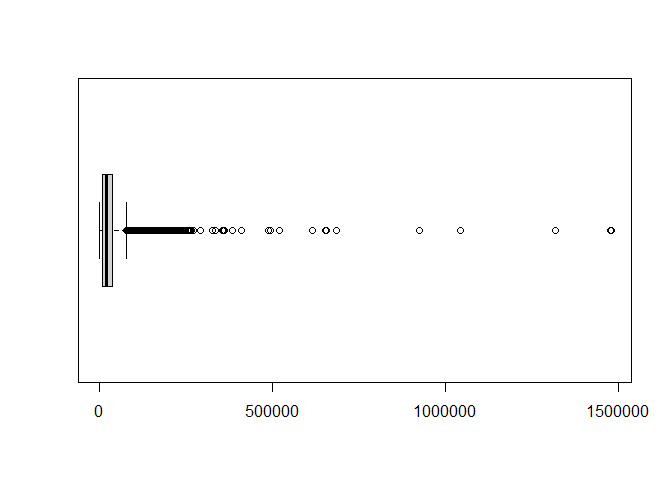

Proyecto 3 Javiera Bustos
================

``` r
library(plyr)
library(ggplot2)
library(tidyverse)
```

    ## -- Attaching packages --------------------------------------- tidyverse 1.3.0 --

    ## v tibble  3.1.0     v dplyr   1.0.5
    ## v tidyr   1.1.3     v stringr 1.4.0
    ## v readr   1.4.0     v forcats 0.5.1
    ## v purrr   0.3.4

    ## -- Conflicts ------------------------------------------ tidyverse_conflicts() --
    ## x dplyr::arrange()   masks plyr::arrange()
    ## x purrr::compact()   masks plyr::compact()
    ## x dplyr::count()     masks plyr::count()
    ## x dplyr::failwith()  masks plyr::failwith()
    ## x dplyr::filter()    masks stats::filter()
    ## x dplyr::id()        masks plyr::id()
    ## x dplyr::lag()       masks stats::lag()
    ## x dplyr::mutate()    masks plyr::mutate()
    ## x dplyr::rename()    masks plyr::rename()
    ## x dplyr::summarise() masks plyr::summarise()
    ## x dplyr::summarize() masks plyr::summarize()

``` r
library(yardstick)
```

    ## Warning: package 'yardstick' was built under R version 4.0.5

    ## For binary classification, the first factor level is assumed to be the event.
    ## Use the argument `event_level = "second"` to alter this as needed.

    ## 
    ## Attaching package: 'yardstick'

    ## The following object is masked from 'package:readr':
    ## 
    ##     spec

``` r
library(tidymodels)
```

    ## Warning: package 'tidymodels' was built under R version 4.0.5

    ## Registered S3 method overwritten by 'tune':
    ##   method                   from   
    ##   required_pkgs.model_spec parsnip

    ## -- Attaching packages -------------------------------------- tidymodels 0.1.3 --

    ## v broom        0.7.7      v recipes      0.1.16
    ## v dials        0.0.9      v rsample      0.1.0 
    ## v infer        0.5.4      v tune         0.1.5 
    ## v modeldata    0.1.0      v workflows    0.2.2 
    ## v parsnip      0.1.6      v workflowsets 0.0.2

    ## Warning: package 'broom' was built under R version 4.0.5

    ## Warning: package 'dials' was built under R version 4.0.5

    ## Warning: package 'infer' was built under R version 4.0.5

    ## Warning: package 'modeldata' was built under R version 4.0.5

    ## Warning: package 'parsnip' was built under R version 4.0.5

    ## Warning: package 'recipes' was built under R version 4.0.5

    ## Warning: package 'rsample' was built under R version 4.0.5

    ## Warning: package 'tune' was built under R version 4.0.5

    ## Warning: package 'workflows' was built under R version 4.0.5

    ## Warning: package 'workflowsets' was built under R version 4.0.5

    ## -- Conflicts ----------------------------------------- tidymodels_conflicts() --
    ## x dplyr::arrange()   masks plyr::arrange()
    ## x purrr::compact()   masks plyr::compact()
    ## x dplyr::count()     masks plyr::count()
    ## x scales::discard()  masks purrr::discard()
    ## x dplyr::failwith()  masks plyr::failwith()
    ## x dplyr::filter()    masks stats::filter()
    ## x recipes::fixed()   masks stringr::fixed()
    ## x dplyr::id()        masks plyr::id()
    ## x dplyr::lag()       masks stats::lag()
    ## x dplyr::mutate()    masks plyr::mutate()
    ## x dplyr::rename()    masks plyr::rename()
    ## x yardstick::spec()  masks readr::spec()
    ## x recipes::step()    masks stats::step()
    ## x dplyr::summarise() masks plyr::summarise()
    ## x dplyr::summarize() masks plyr::summarize()
    ## * Use tidymodels_prefer() to resolve common conflicts.

``` r
library(discrim)
```

    ## Warning: package 'discrim' was built under R version 4.0.5

    ## 
    ## Attaching package: 'discrim'

    ## The following object is masked from 'package:dials':
    ## 
    ##     smoothness

``` r
library(caret)
```

    ## Warning: package 'caret' was built under R version 4.0.5

    ## Loading required package: lattice

    ## 
    ## Attaching package: 'caret'

    ## The following objects are masked from 'package:yardstick':
    ## 
    ##     precision, recall, sensitivity, specificity

    ## The following object is masked from 'package:purrr':
    ## 
    ##     lift

``` r
library(Hmisc)
```

    ## Warning: package 'Hmisc' was built under R version 4.0.5

    ## Loading required package: survival

    ## 
    ## Attaching package: 'survival'

    ## The following object is masked from 'package:caret':
    ## 
    ##     cluster

    ## Loading required package: Formula

    ## 
    ## Attaching package: 'Hmisc'

    ## The following object is masked from 'package:parsnip':
    ## 
    ##     translate

    ## The following objects are masked from 'package:dplyr':
    ## 
    ##     src, summarize

    ## The following objects are masked from 'package:plyr':
    ## 
    ##     is.discrete, summarize

    ## The following objects are masked from 'package:base':
    ## 
    ##     format.pval, units

``` r
library(patchwork)
```

    ## Warning: package 'patchwork' was built under R version 4.0.5

``` r
library(naivebayes)
```

    ## Warning: package 'naivebayes' was built under R version 4.0.5

    ## naivebayes 0.9.7 loaded

``` r
library(kknn)
```

    ## Warning: package 'kknn' was built under R version 4.0.5

    ## 
    ## Attaching package: 'kknn'

    ## The following object is masked from 'package:caret':
    ## 
    ##     contr.dummy

``` r
library(rpart)
```

    ## 
    ## Attaching package: 'rpart'

    ## The following object is masked from 'package:dials':
    ## 
    ##     prune

``` r
library(rpart.plot)
```

    ## Warning: package 'rpart.plot' was built under R version 4.0.5

``` r
library(pROC)
```

    ## Warning: package 'pROC' was built under R version 4.0.5

    ## Type 'citation("pROC")' for a citation.

    ## 
    ## Attaching package: 'pROC'

    ## The following objects are masked from 'package:stats':
    ## 
    ##     cov, smooth, var

# Carga de datos

``` r
data <- readRDS("C:/Users/Javiera/Desktop/RAMOS 2021/Minería/proyectos_mineria/Proyecto_3/endurance.rds")
data_copy1 <- data
head(data)
```

    ##   id type  athlete calories distance elev_low records elev_high max_speed
    ## 1  1 Ride 13279977    520.9  13130.5    337.3       0     375.6      10.5
    ## 2  2 Ride 13279977    538.0  12938.7    338.5       1       477      11.4
    ## 3  3 Ride 13279977    741.6  17515.7    301.6       0       377      11.6
    ## 4  4 Ride 13279977    314.5   7931.4    339.2       0     389.7      10.2
    ## 5  5 Ride 13279977    696.5  17072.7    336.2       1     389.4      14.2
    ## 6  6 Ride 13279977    109.1   3195.0    333.6       0     369.1       6.8
    ##         device_name moving_time elapsed_time average_speed has_heartrate
    ## 1 Strava iPhone App        3908         4326          3.36         FALSE
    ## 2 Strava iPhone App        3791         4975         3.413         FALSE
    ## 3 Strava iPhone App        3837         4510         4.565         FALSE
    ## 4 Strava iPhone App        2280         2521         3.479         FALSE
    ## 5 Strava iPhone App        4188         4473         4.077         FALSE
    ## 6 Strava iPhone App        1237         4166         2.583         FALSE
    ##      start_date_local total_elevation_gain
    ## 1 2015-10-25 07:33:45                206.0
    ## 2 2015-10-23 06:44:01                287.9
    ## 3 2015-10-20 06:04:18                309.1
    ## 4 2015-10-17 18:49:55                156.4
    ## 5 2015-09-06 07:00:39                268.8
    ## 6 2015-09-05 09:34:14                 36.3

# Comprensión y exploración datos

``` r
summary(data)
```

    ##        id             type              athlete            calories       
    ##  Min.   :     1   Length:167615      Min.   : 8558143   Min.   :     0.0  
    ##  1st Qu.: 41905   Class :character   1st Qu.:14204866   1st Qu.:   281.0  
    ##  Median : 83808   Mode  :character   Median :15621719   Median :   629.0  
    ##  Mean   : 83808                      Mean   :15359426   Mean   :   816.7  
    ##  3rd Qu.:125712                      3rd Qu.:16685446   3rd Qu.:  1076.8  
    ##  Max.   :167615                      Max.   :18078075   Max.   :326157.3  
    ##     distance         elev_low           records           elev_high        
    ##  Min.   :      0   Length:167615      Length:167615      Length:167615     
    ##  1st Qu.:   6159   Class :character   Class :character   Class :character  
    ##  Median :  12968   Mode  :character   Mode  :character   Mode  :character  
    ##  Mean   :  21998                                                           
    ##  3rd Qu.:  27494                                                           
    ##  Max.   :1479320                                                           
    ##   max_speed         device_name         moving_time        elapsed_time      
    ##  Length:167615      Length:167615      Min.   :       0   Min.   :        0  
    ##  Class :character   Class :character   1st Qu.:    2248   1st Qu.:     2582  
    ##  Mode  :character   Mode  :character   Median :    3853   Median :     4450  
    ##                                        Mean   :    5141   Mean   :    32102  
    ##                                        3rd Qu.:    6516   3rd Qu.:     7934  
    ##                                        Max.   :11025474   Max.   :511111044  
    ##  average_speed      has_heartrate      start_date_local             
    ##  Length:167615      Length:167615      Min.   :1999-04-25 17:36:38  
    ##  Class :character   Class :character   1st Qu.:2016-11-23 17:11:10  
    ##  Mode  :character   Mode  :character   Median :2019-01-26 13:37:56  
    ##                                        Mean   :2018-05-12 07:50:32  
    ##                                        3rd Qu.:2020-04-30 04:33:10  
    ##                                        Max.   :2021-02-02 11:37:09  
    ##  total_elevation_gain
    ##  Min.   :    0.0     
    ##  1st Qu.:   15.1     
    ##  Median :  171.0     
    ##  Mean   :  397.0     
    ##  3rd Qu.:  595.0     
    ##  Max.   :59595.0

Podemos visualizar que ningún campo contiene NA’s

``` r
str(data)
```

    ## 'data.frame':    167615 obs. of  16 variables:
    ##  $ id                  : int  1 2 3 4 5 6 7 8 9 10 ...
    ##  $ type                : chr  "Ride" "Ride" "Ride" "Ride" ...
    ##  $ athlete             : num  13279977 13279977 13279977 13279977 13279977 ...
    ##  $ calories            : num  521 538 742 314 696 ...
    ##  $ distance            : num  13130 12939 17516 7931 17073 ...
    ##  $ elev_low            : chr  "337.3" "338.5" "301.6" "339.2" ...
    ##  $ records             : chr  "0" "1" "0" "0" ...
    ##  $ elev_high           : chr  "375.6" "477" "377" "389.7" ...
    ##  $ max_speed           : chr  "10.5" "11.4" "11.6" "10.2" ...
    ##  $ device_name         : chr  "Strava iPhone App" "Strava iPhone App" "Strava iPhone App" "Strava iPhone App" ...
    ##  $ moving_time         : num  3908 3791 3837 2280 4188 ...
    ##  $ elapsed_time        : num  4326 4975 4510 2521 4473 ...
    ##  $ average_speed       : chr  "3.36" "3.413" "4.565" "3.479" ...
    ##  $ has_heartrate       : chr  "FALSE" "FALSE" "FALSE" "FALSE" ...
    ##  $ start_date_local    : POSIXct, format: "2015-10-25 07:33:45" "2015-10-23 06:44:01" ...
    ##  $ total_elevation_gain: num  206 288 309 156 269 ...

El dataset cuenta con 167.615 datos en total y 16 variables.  
Variables enteras:  
\* id Variables numéricas:  
\* athlete  
\* calories  
\* distance  
\* moving\_time  
\* elapsed\_time  
\* total\_elevation\_gain  
Variables string/char:  
\* type  
\* elev\_low  
\* records  
\* elev\_high  
\* max\_speed  
\* device\_name  
\* average\_speed  
\* has\_heartrate  
Variables datetime  
\* start\_date\_local

Las variables elev\_low, records, elev\_high, max\_speed, average\_speed
si bien son de tipo chr se refieren a datos numericos que están en tipo
string, por lo tanto solo hay que hacer la conversción str-&gt;float.

Para poder cambiar las variables chr a numéricas veremos qué valores
únicos hay en aquellas que sí almacenan strings.

``` r
head(unique(data[c("type")]))
```

    ##           type
    ## 1         Ride
    ## 29         Run
    ## 34        Walk
    ## 36        Hike
    ## 6923 EBikeRide

``` r
head(unique(data[c("records")]))
```

    ##     records
    ## 1         0
    ## 2         1
    ## 72        4
    ## 92        2
    ## 135      12
    ## 136       3

``` r
unique(data[c("device_name")])
```

    ##                               device_name
    ## 1                       Strava iPhone App
    ## 29                                    GPX
    ## 31                       Garmin fēnix 5X
    ## 33                     Strava Android App
    ## 35                        Garmin Edge 520
    ## 36                   Garmin fēnix 5 Plus
    ## 43                           Trainer Road
    ## 113                                  <NA>
    ## 149                 Garmin Forerunner 935
    ## 157                           Garmin epix
    ## 301                            Strava GPX
    ## 327                       Garmin fēnix 5
    ## 675                  Suunto Spartan Sport
    ## 698                       Garmin Edge 530
    ## 1112                Garmin Forerunner 235
    ## 1132                      Garmin Edge 500
    ## 1639                   Suunto Ambit3 Peak
    ## 1649                               Suunto
    ## 1655                 Apple Watch Series 2
    ## 1683                 Garmin Edge 520 Plus
    ## 1691              Garmin Forerunner 910XT
    ## 1711          Samsung Galaxy Watch Active
    ## 1746                      Garmin Instinct
    ## 1751        Suunto Spartan Sport Wrist HR
    ## 1754                     Garmin fēnix 6X
    ## 1755                 Apple Watch Series 4
    ## 1811                           COROS APEX
    ## 1813                 Apple Watch Series 3
    ## 1988                      Garmin Edge 810
    ## 2049                      Garmin fēnix 3
    ## 2112                   Huami Amazfit Pace
    ## 2149                      Garmin Edge 510
    ## 2224                Garmin fēnix 5S Plus
    ## 2604                      Garmin fēnix 2
    ## 3246                    Garmin VIRB Elite
    ## 3284                Garmin Forerunner 220
    ## 3327                        Garmin fēnix
    ## 3351                Garmin Forerunner 225
    ## 4121                     Garmin fēnix 5S
    ## 4126                             Suunto 9
    ## 4271                      Garmin Edge 830
    ## 4428             Samsung Gear S3 Frontier
    ## 4495                      Garmin Edge 800
    ## 4509                 Garmin Forerunner 45
    ## 4620   Suunto Spartan Sport Wrist HR Baro
    ## 5386                Garmin Forerunner 610
    ## 5846                Garmin Forerunner 305
    ## 6640                    Wahoo ELEMNT BOLT
    ## 6642                 Garmin vívoactive 3
    ## 6673              Garmin Forerunner 735XT
    ## 6685                           Polar M450
    ## 6977                                Wahoo
    ## 7080                      Polar Vantage V
    ## 7127                        Suunto Ambit2
    ## 7555                Garmin fēnix 5X Plus
    ## 7561                          Garmin Venu
    ## 7564                Garmin vívoactive HR
    ## 7597                     Garmin Edge 1030
    ## 8228                       Garmin Edge 25
    ## 8240                      Garmin Edge 130
    ## 8645                           Polar M200
    ## 9023                      iGPSPORT iGS618
    ## 9068                           Polar V800
    ## 9124                      Garmin Edge 820
    ## 9151                 Garmin Forerunner 35
    ## 9226                         Wahoo ELEMNT
    ## 9231                           Polar M430
    ## 10127               Garmin Forerunner 405
    ## 10294                      The Sufferfest
    ## 10585                          Polar M400
    ## 10657               Garmin Forerunner 945
    ## 10751                             SRM PC8
    ## 10797                     Giant Neostrack
    ## 11560             Garmin Forerunner 920XT
    ## 11893                  Garmin vívoactive
    ## 11951               Garmin Forerunner 245
    ## 12040                     Polar Vantage M
    ## 12179         Garmin Forerunner 245 Music
    ## 12321          Garmin vívoactive 3 Music
    ## 12360                    Bryton Rider 530
    ## 12646                   Wahoo ELEMNT ROAM
    ## 12649                Garmin fēnix 6S Pro
    ## 12917                      COROS APEX Pro
    ## 13018                          Polar M600
    ## 13755                Garmin vívoactive 4
    ## 14301                    Bryton Rider 330
    ## 14310                                Xert
    ## 14572                Apple Watch Series 5
    ## 14754                        Fitbit Surge
    ## 15216                     Fitbit Charge 2
    ## 15264                        Suunto Ambit
    ## 16226                Suunto Spartan Ultra
    ## 17605               Garmin Forerunner 210
    ## 17730                   Garmin vívosport
    ## 18886                           Zwift Run
    ## 19543             Garmin Forerunner 310XT
    ## 21779          Apple Watch 1st Generation
    ## 22120                          Polar M460
    ## 22391                              Fitbit
    ## 24157                              TomTom
    ## 28462                               Zwift
    ## 30140                     Garmin Edge 305
    ## 30588                      vívosmart HR+
    ## 30690                         Apple Watch
    ## 30695                 Suunto Ambit3 Sport
    ## 33890                     Suunto Ambit2 S
    ## 38381                         Stages Dash
    ## 43181                               Polar
    ## 43832                    Garmin Edge 1000
    ## 45835                            iGPSPORT
    ## 46370            Garmin Edge Explore 1000
    ## 47632               Garmin Forerunner 620
    ## 51502                    Hammerhead Karoo
    ## 51842                        Wahoo RFLKT+
    ## 54245                     Garmin Edge 705
    ## 62426                      Garmin Connect
    ## 63249                          Polar A360
    ## 63264                        COROS VERTIX
    ## 63265                          Polar V650
    ## 71391               Garmin Forerunner 230
    ## 71908                Garmin Forerunner 15
    ## 72511                            Wattbike
    ## 74264                        Android Wear
    ## 75932                      iGPSPORT iGS60
    ## 77618                   Suunto Ambit3 Run
    ## 82440                    Bryton Rider 310
    ## 86788               Garmin Forerunner 110
    ## 101895              Garmin Forerunner 410
    ## 106930        Garmin Forerunner 645 Music
    ## 108370               Garmin Forerunner 10
    ## 110210                Garmin fēnix 6 Pro
    ## 110663              Garmin Forerunner 645
    ## 111393                      Lezyne Mega C
    ## 111923                     Samsung Health
    ## 112373              Samsung Gear Fit2 Pro
    ## 112812              Garmin vívoactive 4S
    ## 114065                      Peloton Cycle
    ## 114512               Garmin Edge 130 Plus
    ## 114588                    iGPSPORT iGS50E
    ## 114646                      Wattbike Atom
    ## 115035            Suunto Trainer Wrist HR
    ## 115884                       Polar Ignite
    ## 116038              Garmin Edge 1030 Plus
    ## 116223                       Fitbit Versa
    ## 117493                         COROS PACE
    ## 118108                        TrainerRoad
    ## 118113                    iGPSPORT iGS620
    ## 118374              Garmin Instinct Solar
    ## 118514                   Garmin fēnix 6S
    ## 118643              Garmin Forerunner 745
    ## 119682                       Peloton Bike
    ## 120396                    Lezyne Mini GPS
    ## 123504                         Polar A370
    ## 124953                      Xplova X5 Evo
    ## 126056                 Samsung Gear Sport
    ## 126195                      Peloton Tread
    ## 126318                           Suunto 5
    ## 127722                 Lezyne Mega XL GPS
    ## 137314               Apple Watch Series 6
    ## 137663                     Garmin Edge 20
    ## 141810                    COROS Wearables
    ## 144708               Samsung Galaxy Watch
    ## 144861            Samsung Gear S3 Classic
    ## 146312                          OMATA One
    ## 149929      Samsung Galaxy Watch Active 2
    ## 151239                     Apple Watch SE
    ## 153039                     Garmin Venu SQ
    ## 154312                              WHOOP
    ## 157708                       COROS PACE 2
    ## 160329                            Kinomap
    ## 161870                   Suunto 3 Fitness

``` r
unique(data[c("has_heartrate")])
```

    ##    has_heartrate
    ## 1          FALSE
    ## 31          TRUE

La variable “type” almacena 5 strings diferentes: Ride, Run, Walk, Hike
y EBikeRide.  
La variable “records” almacena enteros pero en formato str.  
La variable “device\_name” almacena 171 string diferentes.  
La variable “has\_heartrate” almacena 2 tipos de strings: FALSE, TRUE.

# Transformación de datos

Procederemos a transformar aquellas variables no numéricas a númericas,
con los siguientes valores:  
1. type  
Ride: 0, EBikeRide: 0 , Run: 1, Walk: 1, Hike: 1

``` r
data$type <- mapvalues(data$type, from=c('Ride','EBikeRide'), to=c(0,0))
data$type <- mapvalues(data$type, from=c('Run','Walk', 'Hike'), to=c(1,1,1))
data$type <- as.factor(data$type)
```

``` r
str(data)
```

    ## 'data.frame':    167615 obs. of  16 variables:
    ##  $ id                  : int  1 2 3 4 5 6 7 8 9 10 ...
    ##  $ type                : Factor w/ 2 levels "0","1": 1 1 1 1 1 1 1 1 1 1 ...
    ##  $ athlete             : num  13279977 13279977 13279977 13279977 13279977 ...
    ##  $ calories            : num  521 538 742 314 696 ...
    ##  $ distance            : num  13130 12939 17516 7931 17073 ...
    ##  $ elev_low            : chr  "337.3" "338.5" "301.6" "339.2" ...
    ##  $ records             : chr  "0" "1" "0" "0" ...
    ##  $ elev_high           : chr  "375.6" "477" "377" "389.7" ...
    ##  $ max_speed           : chr  "10.5" "11.4" "11.6" "10.2" ...
    ##  $ device_name         : chr  "Strava iPhone App" "Strava iPhone App" "Strava iPhone App" "Strava iPhone App" ...
    ##  $ moving_time         : num  3908 3791 3837 2280 4188 ...
    ##  $ elapsed_time        : num  4326 4975 4510 2521 4473 ...
    ##  $ average_speed       : chr  "3.36" "3.413" "4.565" "3.479" ...
    ##  $ has_heartrate       : chr  "FALSE" "FALSE" "FALSE" "FALSE" ...
    ##  $ start_date_local    : POSIXct, format: "2015-10-25 07:33:45" "2015-10-23 06:44:01" ...
    ##  $ total_elevation_gain: num  206 288 309 156 269 ...

Transformaremos todos los datos chr a numericos y tambien el campo
start\_date\_local a numerico

``` r
data[, c(6:9,13)] <- sapply(data[, c(6:9,13)], as.numeric)
data$start_date_local <- as.numeric(data$start_date_local)
```

Ya que la variable device\_name requiere de más procesamiento de texto,
en esta instancia la eliminaremos.

``` r
data$device_name <- NULL
```

## Análisis preliminar

Ya con la data limpia y numerica, procederemos a realizar un análisis
preliminar para conocerla mejor.

``` r
describe(data)
```

    ## data 
    ## 
    ##  15  Variables      167615  Observations
    ## --------------------------------------------------------------------------------
    ## id 
    ##        n  missing distinct     Info     Mean      Gmd      .05      .10 
    ##   167615        0   167615        1    83808    55872     8382    16762 
    ##      .25      .50      .75      .90      .95 
    ##    41905    83808   125712   150854   159234 
    ## 
    ## lowest :      1      2      3      4      5, highest: 167611 167612 167613 167614 167615
    ## --------------------------------------------------------------------------------
    ## type 
    ##        n  missing distinct 
    ##   167615        0        2 
    ##                         
    ## Value           0      1
    ## Frequency  110123  57492
    ## Proportion  0.657  0.343
    ## --------------------------------------------------------------------------------
    ## athlete 
    ##        n  missing distinct     Info     Mean      Gmd      .05      .10 
    ##   167615        0      484        1 15359426  1823287 12815322 12941247 
    ##      .25      .50      .75      .90      .95 
    ## 14204866 15621719 16685446 17309898 17560092 
    ## 
    ## lowest :  8558143  8795431  9095042 12045288 12063518
    ## highest: 18060213 18062999 18075116 18076503 18078075
    ## --------------------------------------------------------------------------------
    ## calories 
    ##        n  missing distinct     Info     Mean      Gmd      .05      .10 
    ##   167615        0    24784        1    816.7    789.7        0       50 
    ##      .25      .50      .75      .90      .95 
    ##      281      629     1077     1761     2303 
    ## 
    ## lowest :      0.0      0.1      0.2      0.3      0.4
    ## highest:  41506.6  43095.0  44356.0  59066.0 326157.3
    ##                                                                          
    ## Value           0   5000  10000  15000  20000  25000  30000  35000  40000
    ## Frequency  161103   6361    123     11      5      3      2      2      1
    ## Proportion  0.961  0.038  0.001  0.000  0.000  0.000  0.000  0.000  0.000
    ##                                
    ## Value       45000  60000 325000
    ## Frequency       2      1      1
    ## Proportion  0.000  0.000  0.000
    ## 
    ## For the frequency table, variable is rounded to the nearest 5000
    ## --------------------------------------------------------------------------------
    ## distance 
    ##        n  missing distinct     Info     Mean      Gmd      .05      .10 
    ##   167615        0   130113        1    21998    23942      6.1   1884.2 
    ##      .25      .50      .75      .90      .95 
    ##   6159.1  12968.4  27494.2  52805.0  77045.8 
    ## 
    ## lowest :       0.0       0.1       0.2       0.3       0.4
    ## highest:  924814.0 1043360.0 1319550.0 1478170.0 1479320.0
    ## --------------------------------------------------------------------------------
    ## elev_low 
    ##        n  missing distinct     Info     Mean      Gmd      .05      .10 
    ##   154096    13519    14160        1    557.4    420.6      0.8     14.9 
    ##      .25      .50      .75      .90      .95 
    ##    222.8    595.8    774.0    935.5    991.1 
    ## 
    ## lowest : -3257.1 -2750.8 -2120.8 -1090.6  -608.3
    ## highest:  9366.2  9706.4 10366.8 10490.2 11302.4
    ## --------------------------------------------------------------------------------
    ## records 
    ##        n  missing distinct     Info     Mean      Gmd      .05      .10 
    ##   167615        0      170    0.674    1.791    3.141        0        0 
    ##      .25      .50      .75      .90      .95 
    ##        0        0        1        4        8 
    ## 
    ## lowest :   0   1   2   3   4, highest: 215 230 248 283 622
    ## --------------------------------------------------------------------------------
    ## elev_high 
    ##        n  missing distinct     Info     Mean      Gmd      .05      .10 
    ##   154096    13519    21243        1    848.2    666.6     47.8    119.6 
    ##      .25      .50      .75      .90      .95 
    ##    476.8    728.8   1141.4   1506.8   1865.7 
    ## 
    ## lowest :  -500.0  -499.2  -448.4  -427.0  -340.8
    ## highest: 12605.8 12606.0 12606.2 12606.4 12606.8
    ## --------------------------------------------------------------------------------
    ## max_speed 
    ##        n  missing distinct     Info     Mean      Gmd      .05      .10 
    ##   167615        0     3859        1    9.693    6.389      0.2      3.2 
    ##      .25      .50      .75      .90      .95 
    ##      4.8      9.8     13.7     16.9     18.7 
    ## 
    ## lowest :   0.000   0.001   0.007   0.009   0.015
    ## highest: 135.600 140.600 152.900 167.800 244.600
    ## --------------------------------------------------------------------------------
    ## moving_time 
    ##        n  missing distinct     Info     Mean      Gmd      .05      .10 
    ##   167615        0    18430        1     5141     4476      580     1040 
    ##      .25      .50      .75      .90      .95 
    ##     2248     3853     6516    10228    13068 
    ## 
    ## lowest :        0        1        2        3        4
    ## highest:   514043   608912   909135  3156689 11025474
    ##                                                                           
    ## Value      0.0e+00 1.0e+05 2.0e+05 3.0e+05 4.0e+05 5.0e+05 6.0e+05 9.0e+05
    ## Frequency   167497      96      11       5       1       1       1       1
    ## Proportion   0.999   0.001   0.000   0.000   0.000   0.000   0.000   0.000
    ##                           
    ## Value      3.2e+06 1.1e+07
    ## Frequency        1       1
    ## Proportion   0.000   0.000
    ## 
    ## For the frequency table, variable is rounded to the nearest 100000
    ## --------------------------------------------------------------------------------
    ## elapsed_time 
    ##        n  missing distinct     Info     Mean      Gmd      .05      .10 
    ##   167615        0    22754        1    32102    57330      736     1271 
    ##      .25      .50      .75      .90      .95 
    ##     2582     4450     7934    12930    16909 
    ## 
    ## lowest :         0         1         2         3         4
    ## highest: 377464622 387979240 388497176 509024893 511111044
    ## --------------------------------------------------------------------------------
    ## average_speed 
    ##        n  missing distinct     Info     Mean      Gmd      .05      .10 
    ##   167615        0    10936        1    4.146    2.687    0.011    1.425 
    ##      .25      .50      .75      .90      .95 
    ##    2.606    3.536    5.747    7.276    8.126 
    ## 
    ## lowest :    0.000    0.001    0.002    0.003    0.004
    ## highest:  360.120  362.215  792.677  866.710 2296.088
    ##                                                                          
    ## Value           0     20     40     60     80    100    120    140    160
    ## Frequency  166124   1403     41     18      6      5      3      1      3
    ## Proportion  0.991  0.008  0.000  0.000  0.000  0.000  0.000  0.000  0.000
    ##                                                                   
    ## Value         180    200    220    280    360    800    860   2300
    ## Frequency       2      2      1      1      2      1      1      1
    ## Proportion  0.000  0.000  0.000  0.000  0.000  0.000  0.000  0.000
    ## 
    ## For the frequency table, variable is rounded to the nearest 20
    ## --------------------------------------------------------------------------------
    ## has_heartrate 
    ##        n  missing distinct 
    ##   167615        0        2 
    ##                         
    ## Value       FALSE   TRUE
    ## Frequency   65290 102325
    ## Proportion   0.39   0.61
    ## --------------------------------------------------------------------------------
    ## start_date_local 
    ##         n   missing  distinct      Info      Mean       Gmd       .05       .10 
    ##    167615         0    166695         1 1.526e+09  81220498 1.378e+09 1.412e+09 
    ##       .25       .50       .75       .90       .95 
    ## 1.480e+09 1.549e+09 1.588e+09 1.603e+09 1.607e+09 
    ## 
    ## lowest :  925061798  925061824  925061874  925062171  982037781
    ## highest: 1612252036 1612254638 1612255925 1612265444 1612265829
    ## --------------------------------------------------------------------------------
    ## total_elevation_gain 
    ##        n  missing distinct     Info     Mean      Gmd      .05      .10 
    ##   167615        0    15184    0.994      397    513.1      0.0      0.0 
    ##      .25      .50      .75      .90      .95 
    ##     15.1    171.0    595.0   1042.0   1392.0 
    ## 
    ## lowest :     0.0     1.0     2.0     2.1     2.2
    ## highest: 36429.0 36549.0 36645.0 36905.0 59595.0
    ## --------------------------------------------------------------------------------

Algunas variables, tales como: id, athlete, has\_heartrate,
start\_date\_local y records parecen no ser relevantes para el estudio,
por lo tanto las eliminaremos

``` r
data$id <- NULL
data$athlete <- NULL
data$records <- NULL
data$has_heartrate <- 
data$start_date_local <- NULL
```

Eliminaremos las variables elev\_high y low, ya que
total\_elevation\_gain tambien las representa

``` r
#data$elev <- as.numeric(as.numeric(data$elev_high) - as.numeric(data$elev_low))
data$elev_high <- NULL
data$elev_low <- NULL
```

## Outliers

Como para este estudionos interesa diferenciar las actividades
realizadas en bicicleta o a pie ciertas características, graficaremos
los outliers en estos campos, ya que probablemente los datos atípicos
son aquellos que los usuarios ingresaron mal. (Ride: 0, Run: 1, Walk: 2,
Hike: 3 y EBikeRide:4)

``` r
out_distance <- filter(data, type == 0)
boxplot(out_distance$distance, horizontal = TRUE)
```

<!-- -->

``` r
out_distance2 <- filter(data, type == 1)
boxplot(out_distance2$distance, horizontal = TRUE)
```

<!-- --> En ambos
casos es posible divisar gran cantidad de datos outliers, de esta manera
podemos confirmar a simple vista que sí hay actividades clasificadas
como “Ride” o “Walk” pero erroneas.

``` r
out_avspeed <- filter(data, type == 0)
boxplot(as.numeric(out_avspeed$average_speed), horizontal = TRUE)
```

<!-- -->

``` r
out_avspeed2 <- filter(data, type == 1)
boxplot(as.numeric(out_avspeed2$average_speed), horizontal = TRUE)
```

<!-- -->

# Modelos

A continuación utilizaremos varios modelos de predicción con la
finalidad de escoger el mejor y finalmente poder predecir si una
actividad ingresada como “Ride” o “Walk” es realmente tal actividad o el
usuario se equivocó al ingresarla.

Primero separaremos nuestra data en data de entrenamiento y test.

``` r
#Como en mi notebook los modelos no corrian por la cantidad de datos, tuve que disminuirla
set.seed(123)
data_sample <- sample_n(data, 10000)
#data_sample2 <-data_sample[!(data_sample$type== 0 | data_sample$type== 1),]

data_split <- initial_split(data_sample, prop = 0.8)

train <- training(data_split) 
test <- testing(data_split)
test$pred_0 <- NULL

str(train)
```

    ## 'data.frame':    8000 obs. of  8 variables:
    ##  $ type                : Factor w/ 2 levels "0","1": 1 1 1 2 2 1 1 1 1 1 ...
    ##  $ calories            : num  0 0 1945 327 1022 ...
    ##  $ distance            : num  5952 25011 98336 6041 10017 ...
    ##  $ max_speed           : num  9.9 12 16.6 7 3.7 11.9 14.5 13.1 17.6 13.4 ...
    ##  $ moving_time         : num  1420 3361 14635 1806 3462 ...
    ##  $ elapsed_time        : num  1748 3361 16156 1806 3462 ...
    ##  $ average_speed       : num  4.19 7.44 6.72 3.35 2.89 ...
    ##  $ total_elevation_gain: num  17.2 0 1063 0 286.1 ...

## Creación de modelo

``` r
receta <- 
  recipe(type ~ ., data = train)

receta
```

    ## Data Recipe
    ## 
    ## Inputs:
    ## 
    ##       role #variables
    ##    outcome          1
    ##  predictor          7

## Modelo de árbol de decisión

Definimos el modelo de arbol de decision con 5 capas de decision, y un
minimo numero de entidades por hoja (poda) de 10.

``` r
modelo_trees <-
  decision_tree(tree_depth = 5, min_n = 10) %>% 
  set_engine("rpart") %>% 
  set_mode("classification")

modelo_trees
```

    ## Decision Tree Model Specification (classification)
    ## 
    ## Main Arguments:
    ##   tree_depth = 5
    ##   min_n = 10
    ## 
    ## Computational engine: rpart

A continuación hacemos el fit del modelo, calculamos sus predicciones y
calculamos el valor de AUC.

``` r
library(tibble)
library(pROC)

fit_mod <- function(mod){
  
  modelo_fit <- 
  workflow() %>% 
  add_model(mod) %>% 
  add_recipe(receta) %>% 
  fit(data = train)

model_pred <- 
  predict(modelo_fit, test, type = "prob") %>% 
  bind_cols(test) 

return(model_pred
       %>% 
  roc_auc(truth = type, .pred_0))

}
```

``` r
fit_mod(modelo_trees)
```

    ## # A tibble: 1 x 3
    ##   .metric .estimator .estimate
    ##   <chr>   <chr>          <dbl>
    ## 1 roc_auc binary         0.916

Los resultados arrojados por el modelo Arbol de decision son, roc\_auc =
0.92

Ahora se iterará con otros modelos con el fin de encontrar el que posea
el mejor AUC.

## Naive Bayes

``` r
library(naivebayes)

modelo_nb <-
  naive_Bayes(smoothness = .8) %>%
  set_engine("naivebayes")

fit_mod(modelo_nb)
```

    ## # A tibble: 1 x 3
    ##   .metric .estimator .estimate
    ##   <chr>   <chr>          <dbl>
    ## 1 roc_auc binary         0.960

Naive bayes entrega un AUC de 0,95

## KNN

``` r
#library(kknn)

#modelo_knn <-
 # nearest_neighbor(neighbors = 6) %>% 
  #set_engine("kknn") %>% 
  #set_mode("classification")

#fit_mod(modelo_knn) 
```

## Regresion Logistica

``` r
modelo_rl <- 
  logistic_reg() %>% 
  set_engine("glm")

fit_mod(modelo_rl)
```

    ## Warning: glm.fit: fitted probabilities numerically 0 or 1 occurred

    ## # A tibble: 1 x 3
    ##   .metric .estimator .estimate
    ##   <chr>   <chr>          <dbl>
    ## 1 roc_auc binary         0.901

Regresión logistica entrega un AUC = 0,90

``` r
library(rpart.plot)

type <- rpart(type~., data = train, method = "class")

rpart.plot(type)
```

<!-- -->

### Mejores resultados de modelos

Aquellos modelos que arrojaron mayor AUC son Decision Trees y Naive
Bayes. Escogeremos Decision Trees ya que Naives posee un AUC demasiado
alto y esto podría ser señal de overfitting en el modelo.

# Predicción

``` r
library(rpart.plot) 
pred_type <- predict(type, newdata = test, type = "class")
pred_type %>% as.data.frame() %>% head()
```

    ##    .
    ## 13 1
    ## 17 0
    ## 19 0
    ## 36 0
    ## 41 0
    ## 43 0

``` r
pred_type %>% as.data.frame() %>% tail()
```

    ##      .
    ## 9966 1
    ## 9976 0
    ## 9980 0
    ## 9981 1
    ## 9992 0
    ## 9999 0

``` r
test$predictedtype <- pred_type
```

``` r
pred_type_roc <- predict(type, newdata = test, type = "prob")
pred_type_roc %>% as.data.frame() %>% head()
```

    ##            0          1
    ## 13 0.0594947 0.94050530
    ## 17 0.9422105 0.05778945
    ## 19 0.9422105 0.05778945
    ## 36 0.9422105 0.05778945
    ## 41 0.9422105 0.05778945
    ## 43 0.9422105 0.05778945

``` r
pred_type_roc <- pred_type_roc %>% as.data.frame()
prob <- pred_type_roc$"1"
```

# Evaluación modelo

``` r
cm <- confusionMatrix(table(test$type, test$predictedtype))
test$predictedtype <- as.factor(test$predictedtype)

table <- data.frame(confusionMatrix(test$type, test$predictedtype)$table)

print(cm)
```

    ## Confusion Matrix and Statistics
    ## 
    ##    
    ##        0    1
    ##   0 1253   44
    ##   1  107  596
    ##                                          
    ##                Accuracy : 0.9245         
    ##                  95% CI : (0.912, 0.9357)
    ##     No Information Rate : 0.68           
    ##     P-Value [Acc > NIR] : < 2.2e-16      
    ##                                          
    ##                   Kappa : 0.8309         
    ##                                          
    ##  Mcnemar's Test P-Value : 4.524e-07      
    ##                                          
    ##             Sensitivity : 0.9213         
    ##             Specificity : 0.9313         
    ##          Pos Pred Value : 0.9661         
    ##          Neg Pred Value : 0.8478         
    ##              Prevalence : 0.6800         
    ##          Detection Rate : 0.6265         
    ##    Detection Prevalence : 0.6485         
    ##       Balanced Accuracy : 0.9263         
    ##                                          
    ##        'Positive' Class : 0              
    ## 

``` r
plotTable <- table %>%
  mutate(goodbad = ifelse(table$Prediction == table$Reference, "Good", "Bad")) %>%
  group_by(Reference) %>%
  mutate(prop = Freq/sum(Freq))

confusionMatrix <- ggplot(data = plotTable, mapping = aes(x = Reference, y = Prediction, fill = goodbad, alpha = prop)) +
  geom_tile() +
  geom_text(aes(label = Freq), vjust = .5, fontface  = "bold", alpha = 25, size = 8) +
  scale_fill_manual(name = " ", values = c(Good = "#F0FF00", Bad = "#34495E")) +
  scale_alpha(name = " ") +
  theme_classic() +
  xlim(rev(levels(table$Reference))) +
  scale_y_discrete(name = "Predicted", limits = c("1","0")) + 
  scale_x_discrete(name = "Actual", position = "top") +
  #theme(legend.position = " ") +
  theme(text=element_text(size=25,  family="sans")) + 
  ggtitle("Confusion Matrix") +
  theme(plot.title = element_text(size = 25, family="sans", face = "bold"))
```

    ## Scale for 'x' is already present. Adding another scale for 'x', which will
    ## replace the existing scale.

``` r
confusionMatrix
```

<!-- --> La
matriz nos entrega resultados alentadores frente al modelo. tan solo 111
datos fueron clasificados mal.

## Curva ROC

``` r
ROC <- roc(test$type,prob)
```

    ## Setting levels: control = 0, case = 1

    ## Setting direction: controls < cases

``` r
plot(ROC, col = "#fd634b", family = "sans", cex = 2, main = "CART Model ROC Curve 
AUC = 0.92")
```

<!-- -->

``` r
auc(ROC)
```

    ## Area under the curve: 0.9159

## Chequeo de Overfitting

``` r
is_predictedtype <- predict(type,newdata=train,type='class')
misClassError <- mean(is_predictedtype != train$type)
print(paste('Train-set Accuracy =',1-misClassError))
```

    ## [1] "Train-set Accuracy = 0.9335"

``` r
misClassError <- mean(test$predictedtype != test$type)
print(paste('Test-set Accuracy =',1-misClassError))
```

    ## [1] "Test-set Accuracy = 0.9245"

-   Tomando en cuenta los resultado de Train y Test accuracy podemos
    concluir que el modelo no se supero asi mismo.

# Conclusiones

Luego de probar con varios modelos se llegó a la conclusión de que el
mejor modelo sería DECISION TREES, esto por poseer el AUC más alto y no
presentar overfitting.

Utilizando este modelo podremos predecir el tipo de actividad ingresada
por el usuario tomando encuenta: calories, max\_speed, moving\_time,
elapsed\_time, average\_speed y total\_elevation\_gain.

En caso que la actividad predecida sea distinta a la ingresada por el
usuario podría levantarse una alerta o un nuevo campo que registre que
los datos ingresados probablemente no son los correctos.
